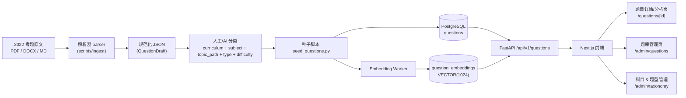

<aside>
🎯

**目标**：把 2022 年考题（PDF / Word / Markdown 原文）规范化、分类、向量化，写入现有 `questions` + `question_embeddings` 表；并在前端提供 **题目详情/分析页** 和 **题库管理页**（含科目、题型管理）。

本文档面向 **DeepSeek-V4-Flash + Cline**，按阶段、按文件、按函数粒度给出可执行的步骤、目录结构、代码骨架与验收标准。

</aside>

<aside>
🏷️

**开发流程标签（对齐 [Globot 开发日志 - AI 辅助开发流程（Cline + DeepSeek + Opus）](https://www.notion.so/Globot-AI-Cline-DeepSeek-Opus-f7f32c31e59b427cb11aed8c98f9d76a?pvs=21)）**

- 主体归属：**Stage 1 — 题库基础（W1-W2）**
- 跨入：**Stage 2 — 录题/管理后台前端切片（W3-W4）**
- 预演：**Stage 3 — AI 题库流水线（W5-W6，§3 仅作最简前置，Celery / OCR / 法条链接器仍归 Stage 3）**
- **不覆盖**：Phase 0 冷启动数据、Stage 4 知识图谱+FSRS、Stage 5 推荐+对话、Stage 6 自学看板
- 产品定位：**个人法考备考平台，单一用户 Zhihua，单一 curriculum = `FAKAO`，8 大科目**
</aside>

## 0a. 与开发日志 / README 的同步状态

**简评**：本计划 **方向正确但需法考化改造**。

- ✅ 符合 backend README：`questions` / `question_embeddings` / pgvector 1024 维 / FastAPI + SQLAlchemy async 全部对齐。
- ✅ 符合 frontend README：Next.js 14 App Router + TailwindCSS + shadcn/ui 一致；现有 `src/types/question.ts` 与 §4.1 schemas 兼容。
- ✅ 符合 work folder README：题型枚举一致，`docs/` 路径一致。
- ⚠️ **与开发日志存在偏差**：开发日志已于 2026.5 定版为 **法考个人版（单 curriculum + 8 大科目）**，本计划仍保留 IGCSE / Computer Science 示例与“多课程下拉”思路。需按下节“法考化改造清单”修正。

### 阶段映射（M1–M7 ↔ 开发日志 Stage）

| 本计划 Milestone | 对应开发日志阶段 | 说明 |
| --- | --- | --- |
| M1 后端骨架（§2.3 + §4.1 + §4.2） | **Stage 1 — Day 1-3** | 对应日志 B-1 脚手架 + B-2 DDL（需加 legal_articles、question_versions） |
| M2 后端 API（§4.3 + §4.4） | **Stage 1 — Day 4-6** | 对应日志 B-3 Repository + Service |
| M3 导入流水线（§3） | **Stage 1 — Day 7-8**  • Stage 3 预演 | 日志 B-5 Seed + Eval；OCR / Celery / 法条链接器留给 Stage 3 |
| M4 前端详情页（§5） | **Stage 2 — admin 切片（Day 5-7）** | 开发日志的 admin 录题后台 detail 视图 |
| M5 前端管理页（§6） | **Stage 2 — Day 8-10** | 对应日志 B-4 录题后台 list + import 页 |
| M6 Taxonomy 管理（§7） | **Stage 1 — Day 9-10** | 需法考化：curriculum 改为单值常量，subjects 固化为 8 科 seed |
| M7 打磨 | **Stage 1/2 收尾** | 覆盖率门禁、i18n、Sentry；MVP 期先不上 Lighthouse 各项打磨 |

### 模型分工补充（对齐开发日志）

原计划只提及 DeepSeek-V4-flash，但开发日志明确三分工：

- **Claude Opus 4.7** → 架构/Plan/ADR（本计划本身属于 Opus 产出）
- **DeepSeek-V4-pro（Cline Plan + Act）** → **M1–M6 主力实现**（以前的“面向 flash”需修正为“面向 pro”）
- **DeepSeek-V4-flash** → **跑测试、补 docstring、boilerplate**（§4.6 测试与 M7 打磨步骤）

### 法考化改造清单（Cline 在 M1 之前必须完成，当作 **M0 前置**）

- [ ]  把所有示例里的 `IGCSE` / `Computer Science` 替换为 `法考` / 8 大科目之一（民法 / 刑法 / 行政法 / 商经法 / 三国法 / 理论法 / 刑诉 / 民诉）。
- [ ]  把 §2.3 的 `curricula` 表 **简化为单行常量**（`code='FAKAO', name='中国国家统一法律职业资格考试'`），由 Alembic 直接 seed；前端 curriculum 下拉去掉，整站默认 `FAKAO`。
- [ ]  `subjects` 表 **预置 8 行**，code 固定（`civil/criminal/admin/commercial/intl/theory/crim-proc/civ-proc`），不允许在 UI 增删，只允许改 description。
- [ ]  **新增 `legal_articles` 表**（开发日志 Stage 1 Day 2-3 明确要求）：`article_id, subject, article_number, content, interpretation, is_high_freq, effective_date`；写入 `alembic/versions/0002_legal_articles.py`。
- [ ]  **`questions` 表追加列**（在现表基础上平滑迁移，不动原有列）：
    - `cited_articles UUID[]` — 关联 legal_articles，GIN 索引
    - `source_year SMALLINT` — 真题年份，追踪法条修订
    - `is_indeterminate BOOLEAN DEFAULT FALSE` — 不定项选择标记
- [ ]  **新增 `question_versions` 表 + 触发器**（开发日志 B-2 明确要求）：questions 写入时自动落版本。
- [ ]  §2.2 题型枚举保持不变，但 **`rubric` 支持“案例分析按问分项打分”**：`{ "sub_questions": [ { "id": "(1)", "max_marks": 5, "criteria": [...] }, ... ] }`。
- [ ]  §3.3 的 `multiple_choice` 行拆出子类 `is_indeterminate=true`，且 `answer` 支持 **部分给分**（`rubric.partial_credit_rule = "ratio" | "all_or_nothing"`）。
- [ ]  §4.3 新增 `/api/v1/legal-articles` 路由（list / get / search by keyword|subject）。
- [ ]  §5.2 详情页 Side panel 新增 **“关联法条”** 区块（点击跳法条速查页，Phase 2 实现，先预留 anchor）。
- [ ]  §3.4 `classify.py` 的 SYSTEM_PROMPT 改为法考版：固定 `curriculum=FAKAO`，让 LLM 只决定 subject + topic_path + type + is_indeterminate + cited_articles。
- [ ]  §10 的 Cline 提示词模板顶部加一行：`This is a personal 法考 prep platform. Single user (Zhihua). Single curriculum (FAKAO). Do not introduce multi-curriculum abstractions.`
- [ ]  把当前 “面向 DeepSeek-V4-Flash” 的描述改为 **“面向 Cline + DeepSeek-V4-pro（实现）+ flash（测试/打磨）”**。

### 不在本计划范围（属于后续 Stage）

按开发日志，下列内容 **不要** 在本计划里展开，留给后续阶段：

- **Stage 2 完整**：Auth（邮箱密码）/ LiteLLM 网关 / system prompt YAML 模板 / OpenTelemetry
- **Stage 3 完整**：Celery 流水线 / PaddleOCR + GOT-OCR2.0 + Qwen2-VL / 法条链接器 / 审核 UX 快捷键
- **Stage 4**：profile L1-L4 / event bus / FSRS 调度 / system prompt 注入
- **Stage 5**：备考进度模型 / Socratic AI 对话助手 / 错题本
- **Stage 6**：自学看板 / 周报 / 每日推送

如果 Cline 在 M1–M7 期间发现需要这些能力，**写 TODO 并在注释里引用开发日志对应 Stage**，不要现场实现。

---

## 0. 阅读顺序与约定

1. 先读 **§1 总体架构** → **§2 数据模型与分类体系** → **§3 题目导入流水线**。
2. 后端 API 实现按 **§4** 顺序写：schemas → repository → service → router → tests。
3. 前端按 **§5（详情/分析页）→ §6（管理页）→ §7（科目/题型管理）** 顺序实现。
4. 每个阶段末尾都有 **✅ Cline 验收清单**，请逐条勾选后再进入下一阶段。

**命名约定**

- 后端：Python 3.12，FastAPI + SQLAlchemy 2.0 async + Pydantic 2。所有新文件遵循 README 中 `app/` 目录结构。
- 前端：默认 **Next.js 14 (App Router) + TypeScript + TailwindCSS + shadcn/ui + TanStack Query**。若你已用别的栈，请在 §5.0 替换为对应等价物。
- 所有 ID 用 `UUID`；所有时间 `TIMESTAMPTZ`。
- 接口路径前缀 `/api/v1`。

---

## 1. 总体架构



**关键决策**

- 题目源数据 **不直接** 入库：先生成中间格式 `QuestionDraft`（JSON Lines），方便人工/AI 复核。
- 分类体系采用 **两层固定枚举 + 一层数组路径**：`curriculum`（如 `IGCSE`）→ `subject`（如 `Computer Science`）→ `topic_path: text[]`（如 `['Hardware', 'CPU', 'Fetch-Execute Cycle']`）。
- 题型固定为后端 `QuestionType` 枚举（见 §2.2），不允许前端自由新增；如要扩展，走 Alembic 迁移。
- 向量生成 **异步**：导入后由 worker 补齐 embedding，不阻塞写入。

---

## 2. 数据模型与分类体系

### 2.1 现有 `questions` 表（来自 README）

| 列 | 类型 | 说明 |
| --- | --- | --- |
| `id` | UUID PK |  |
| `curriculum` | TEXT | 如 `IGCSE` / `IB` / `A-Level` / `GAOKAO` |
| `subject` | TEXT | 如 `Computer Science` |
| `topic_path` | TEXT[] | 层级主题路径 |
| `difficulty` | SMALLINT (1–5) |  |
| `type` | ENUM `question_type` | 见 §2.2 |
| `stem` | TEXT | 题干（Markdown，可含 LaTeX / 图片 URL） |
| `options` | JSONB | 选择题选项；非选择题为 `null` |
| `answer` | TEXT | 标准答案（短答案/数字/选项 key） |
| `rubric` | JSONB | 评分细则（论述题/编程题） |
| `solution` | TEXT | 解析（Markdown） |
| `variants` | UUID[] | 同题变体 |
| `source_origin` | TEXT | 如 `IGCSE-CS-2022-Paper1-Q3` |
| `created_at` / `updated_at` | TIMESTAMPTZ |  |

> ⚠️ Cline 注意：**不要修改 `questions` 表结构**，本计划只 **新增** 表（见 §2.3）。
> 

### 2.2 题型枚举（与 README 对齐）

```python
# app/models/question.py 中应已有，确认枚举值如下
class QuestionType(str, enum.Enum):
	multiple_choice = "multiple_choice"  # 多选
	single_choice   = "single_choice"    # 单选
	true_false      = "true_false"
	fill_blank      = "fill_blank"
	short_answer    = "short_answer"
	essay           = "essay"
	code            = "code"
	matching        = "matching"
	ordering        = "ordering"
```

每种题型的 `options` / `answer` / `rubric` 规范见 §3.3 **Schema 标准**。

### 2.3 新增三张元数据表（用于前端的科目/题型/课程管理）

现状下 `curriculum` / `subject` 是 TEXT 自由字段，前端无法稳定地下拉选择。**新增 3 张引用表 + 1 张视图**，但 `questions` 表仍保留原 TEXT 列以保证兼容：

```sql
-- alembic/versions/0002_add_taxonomy.py 中要生成：

CREATE TABLE curricula (
	id          UUID PRIMARY KEY DEFAULT gen_random_uuid(),
	code        TEXT UNIQUE NOT NULL,   -- 'IGCSE'
	name        TEXT NOT NULL,          -- 'IGCSE (Cambridge)'
	description TEXT,
	created_at  TIMESTAMPTZ DEFAULT NOW(),
	updated_at  TIMESTAMPTZ DEFAULT NOW()
);

CREATE TABLE subjects (
	id            UUID PRIMARY KEY DEFAULT gen_random_uuid(),
	curriculum_id UUID NOT NULL REFERENCES curricula(id) ON DELETE CASCADE,
	code          TEXT NOT NULL,        -- 'CS'
	name          TEXT NOT NULL,        -- 'Computer Science'
	description   TEXT,
	created_at    TIMESTAMPTZ DEFAULT NOW(),
	updated_at    TIMESTAMPTZ DEFAULT NOW(),
	UNIQUE (curriculum_id, code)
);

CREATE TABLE topics (
	id          UUID PRIMARY KEY DEFAULT gen_random_uuid(),
	subject_id  UUID NOT NULL REFERENCES subjects(id) ON DELETE CASCADE,
	parent_id   UUID REFERENCES topics(id) ON DELETE CASCADE,
	name        TEXT NOT NULL,
	slug        TEXT NOT NULL,
	depth       SMALLINT NOT NULL,      -- 0=一级
	created_at  TIMESTAMPTZ DEFAULT NOW(),
	UNIQUE (subject_id, parent_id, slug)
);

-- 题型在代码层是枚举，但前端管理页需要可读元数据，因此用一个静态表（只允许后端 seed）
CREATE TABLE question_types (
	code        TEXT PRIMARY KEY,        -- 'single_choice'
	label_en    TEXT NOT NULL,
	label_zh    TEXT NOT NULL,
	requires_options BOOLEAN NOT NULL,
	requires_rubric  BOOLEAN NOT NULL,
	description TEXT
);
```

> Cline：**Alembic 迁移文件请用 `op.create_table(...)`**，不要手写 SQL；上面 SQL 只是逻辑示意。
> 

### 2.4 索引（性能必备）

```sql
CREATE INDEX ix_questions_curriculum_subject ON questions(curriculum, subject);
CREATE INDEX ix_questions_type               ON questions(type);
CREATE INDEX ix_questions_difficulty         ON questions(difficulty);
CREATE INDEX ix_questions_topic_path_gin     ON questions USING GIN (topic_path);
CREATE INDEX ix_questions_source_origin     ON questions(source_origin);
-- 全文检索（题干）
CREATE INDEX ix_questions_stem_trgm ON questions USING GIN (stem gin_trgm_ops);
-- 向量近邻
CREATE INDEX ix_qe_embedding_hnsw ON question_embeddings USING hnsw (embedding vector_cosine_ops);
```

（`pg_trgm` 与 `vector` extension 需在迁移开头 `CREATE EXTENSION IF NOT EXISTS ...`。）

---

## 3. 题目导入流水线（处理 2022 年考题）

### 3.1 目录结构（新增）

```
backend/
├── scripts/
│   └── ingest/
│       ├── __init__.py
│       ├── parse_pdf.py          # PDF → 原始文本块
│       ├── parse_docx.py         # DOCX → 原始文本块
│       ├── parse_markdown.py     # MD → 原始文本块
│       ├── normalize.py          # 文本块 → QuestionDraft (JSON Lines)
│       ├── classify.py           # 调 LLM 给 curriculum/subject/topic_path/type/difficulty
│       ├── seed_questions.py     # JSON Lines → questions 表（幂等）
│       └── embed_worker.py       # 扫描未向量化的 question → question_embeddings
├── data/
│   ├── raw/
│   │   └── 2022/                 # 放原始 PDF / DOCX
│   ├── drafts/
│   │   └── 2022.jsonl            # 中间产物（人工可审）
│   └── seeded/
│       └── 2022.done.json        # 已入库记录（含 question.id 映射）
```

### 3.2 中间格式 `QuestionDraft`（JSON Lines，每行一题）

```json
{
	"source_origin": "IGCSE-CS-2022-Paper1-Q3",
	"raw_text": "3. Explain the fetch-execute cycle ...",
	"page": 4,
	"proposed": {
		"curriculum": "IGCSE",
		"subject": "Computer Science",
		"topic_path": ["Hardware", "CPU", "Fetch-Execute Cycle"],
		"type": "short_answer",
		"difficulty": 3,
		"stem": "Explain the fetch-execute cycle.",
		"options": null,
		"answer": "The CPU fetches the instruction ...",
		"rubric": { "max_marks": 6, "criteria": ["Mentions fetch", "Mentions decode", "Mentions execute"] },
		"solution": "Step 1 ... Step 2 ..."
	},
	"review": { "status": "pending", "reviewer": null, "notes": null }
}
```

**为什么用 JSONL？** 方便逐行 grep、`jq` 处理、git diff，导入失败也只丢一行。

### 3.3 各题型的 `options` / `answer` / `rubric` 规范

| `type` | `options` | `answer` | `rubric` |
| --- | --- | --- | --- |
| `single_choice` | `[{"key":"A","text":"..."}, ...]` | `"B"` | null |
| `multiple_choice` | 同上 | `"A,C"` （逗号分隔，按字典序） | null |
| `true_false` | null | `"true"` / `"false"` | null |
| `fill_blank` | `{"blanks": 3}` | `"ans1 \ | ans2 \ |
| `short_answer` | null | 参考答案文本 | `{max_marks, criteria[]}` |
| `essay` | null | 大纲/范文 | `{max_marks, levels:[{band, descriptor}]}` |
| `code` | `{"language":"python","starter":"..."}` | 参考代码 | `{max_marks, tests:[{input,output}]}` |
| `matching` | `{"left":[...],"right":[...]}` | `"1-B,2-A,3-D"` | null |
| `ordering` | `{"items":["A","B","C","D"]}` | `"C,A,D,B"` | null |

Cline 必须在 `app/schemas/question.py` 用 **Pydantic discriminated union** 校验上述形状，见 §4.1。

### 3.4 解析与分类脚本骨架

**`scripts/ingest/parse_pdf.py`**

```python
"""PDF → list[RawBlock]
用法: python -m scripts.ingest.parse_pdf data/raw/2022/paper1.pdf > data/drafts/2022_paper1.raw.jsonl
依赖: pypdf>=4.0 ; 若有扫描件用 pdfplumber + pytesseract
"""
from __future__ import annotations
import json, sys, re
from pathlib import Path
from pypdf import PdfReader

QUESTION_PATTERN = re.compile(r"^\s*(\d{1,3})[.)]\s+(.*)", re.MULTILINE)

def extract_blocks(pdf_path: Path) -> list[dict]:
	reader = PdfReader(str(pdf_path))
	blocks: list[dict] = []
	for page_no, page in enumerate(reader.pages, start=1):
		text = page.extract_text() or ""
		for m in QUESTION_PATTERN.finditer(text):
			blocks.append({
				"q_no": int(m.group(1)),
				"page": page_no,
				"raw_text": m.group(0).strip(),
			})
	return blocks

if __name__ == "__main__":
	for b in extract_blocks(Path(sys.argv[1])):
		print(json.dumps(b, ensure_ascii=False))
```

**`scripts/ingest/classify.py`**

```python
"""用 LLM 把 raw_text 升级为 QuestionDraft.proposed。
建议先用规则（关键词、题号格式）打底，再让 LLM 补字段。
Cline 注意：把 LLM 调用封装在 app/services/llm.py，本脚本只通过 ChatService 调用。
"""
from app.services.llm import ChatService  # 你可以新建一个 Provider 抽象

SYSTEM_PROMPT = '''You are a curriculum tagger. Given a raw exam question text,
return STRICT JSON with keys: curriculum, subject, topic_path (array, depth<=4),
type (one of multiple_choice|single_choice|true_false|fill_blank|short_answer|essay|code|matching|ordering),
difficulty (1-5), stem, options, answer, rubric, solution. No prose.'''
```

**`scripts/ingest/seed_questions.py`**

```python
"""幂等地把 data/drafts/*.jsonl 写进 questions 表。
幂等键: (source_origin)。已存在则按 --update / --skip 处理。
"""
import asyncio, json, argparse
from pathlib import Path
from sqlalchemy import select
from app.database import async_session_factory
from app.models.question import Question

async def seed_file(path: Path, mode: str = "skip") -> tuple[int, int]:
	created = updated = 0
	async with async_session_factory() as s:
		for line in path.read_text(encoding="utf-8").splitlines():
			row = json.loads(line)
			p = row["proposed"]
			existing = (await s.execute(
				select(Question).where(Question.source_origin == row["source_origin"])
			)).scalar_one_or_none()
			if existing and mode == "skip":
				continue
			if existing and mode == "update":
				for k, v in p.items():
					setattr(existing, k, v)
				updated += 1
			else:
				s.add(Question(source_origin=row["source_origin"], **p))
				created += 1
		await s.commit()
	return created, updated

if __name__ == "__main__":
	ap = argparse.ArgumentParser()
	ap.add_argument("path")
	ap.add_argument("--mode", choices=["skip", "update"], default="skip")
	args = ap.parse_args()
	c, u = asyncio.run(seed_file(Path(args.path), args.mode))
	print(f"created={c} updated={u}")
```

**`scripts/ingest/embed_worker.py`**

```python
"""扫描 questions 表中尚无 question_embeddings 的行，调用 embedding model 生成向量。
模型维度 1024（与现表一致）。建议每批 32 条。
"""
```

### 3.5 端到端命令序列（写进 README）

```bash
# 1. 解析 2022 原文
python -m scripts.ingest.parse_pdf data/raw/2022/paper1.pdf > data/drafts/2022_paper1.raw.jsonl

# 2. 规范化 + 分类（人在循环可选）
python -m scripts.ingest.classify data/drafts/2022_paper1.raw.jsonl > data/drafts/2022_paper1.jsonl

# 3. 人工抽样审核（建议至少 10%）
#   - 用 VS Code 直接打开 jsonl 修改 proposed 字段
#   - review.status 改成 "approved" 才会被 seed

# 4. 写库（幂等）
python -m scripts.ingest.seed_questions data/drafts/2022_paper1.jsonl --mode skip

# 5. 生成向量
python -m scripts.ingest.embed_worker --batch 32
```

**✅ Cline 验收清单（§3）**

- [ ]  `scripts/ingest/` 5 个脚本均可独立 `python -m` 运行。
- [ ]  `data/drafts/2022_*.jsonl` 文件被生成且每行可被 `pydantic` 校验（见 §4.1 `QuestionDraft`）。
- [ ]  重复执行 `seed_questions.py` 不会产生重复行。
- [ ]  至少 50 道 2022 题目入库，且 `question_embeddings` 已填充。

---

## 4. 后端 API（FastAPI）

### 4.1 Schemas（`app/schemas/question.py` 扩展）

```python
from __future__ import annotations
from typing import Annotated, Literal, Union
from uuid import UUID
from datetime import datetime
from pydantic import BaseModel, Field, conint, ConfigDict

Difficulty = Annotated[int, Field(ge=1, le=5)]

class OptionItem(BaseModel):
	key: str
	text: str

class SingleChoiceOptions(BaseModel):
	type: Literal["single_choice"]
	options: list[OptionItem]

class MultipleChoiceOptions(BaseModel):
	type: Literal["multiple_choice"]
	options: list[OptionItem]

# ... 其他题型 ...

OptionsUnion = Annotated[
	Union[SingleChoiceOptions, MultipleChoiceOptions, ...],
	Field(discriminator="type"),
]

class QuestionBase(BaseModel):
	curriculum: str
	subject: str
	topic_path: list[str] = []
	difficulty: Difficulty
	type: str  # QuestionType
	stem: str
	options: dict | list | None = None
	answer: str | None = None
	rubric: dict | None = None
	solution: str | None = None
	source_origin: str | None = None

class QuestionCreate(QuestionBase): pass
class QuestionUpdate(BaseModel):
	model_config = ConfigDict(extra="forbid")
	# 全部字段 Optional ...

class QuestionResponse(QuestionBase):
	id: UUID
	created_at: datetime
	updated_at: datetime
	has_embedding: bool = False

class QuestionList(BaseModel):
	items: list[QuestionResponse]
	total: int
	page: int
	page_size: int
```

### 4.2 Repository（`app/repositories/question_repo.py` 新建）

负责所有 SQLAlchemy 语句。**所有筛选、排序、分页都在这里实现**，service 不写 SQL。

```python
class QuestionRepo:
	def __init__(self, session: AsyncSession): self.s = session

	async def search(self, *, curriculum=None, subject=None, topic=None,
					 types=None, difficulty=None, q=None,
					 page=1, page_size=20, sort="-created_at") -> tuple[list[Question], int]:
		stmt = select(Question)
		if curriculum: stmt = stmt.where(Question.curriculum == curriculum)
		if subject:    stmt = stmt.where(Question.subject == subject)
		if topic:      stmt = stmt.where(Question.topic_path.contains([topic]))
		if types:      stmt = stmt.where(Question.type.in_(types))
		if difficulty: stmt = stmt.where(Question.difficulty == difficulty)
		if q:          stmt = stmt.where(Question.stem.ilike(f"%{q}%"))
		# ... order/limit/offset ...
```

### 4.3 Routers（新增 4 个）

```
app/routers/
├── questions.py        # /api/v1/questions
├── taxonomy.py         # /api/v1/curricula, /subjects, /topics
├── question_types.py   # /api/v1/question-types
└── analysis.py         # /api/v1/questions/{id}/analysis（统计 + 相似题 + AI 解析）
```

**`/api/v1/questions` 端点列表**

| 方法 | 路径 | 说明 |
| --- | --- | --- |
| GET | `/api/v1/questions` | 列表 + 筛选 + 搜索 + 分页 |
| POST | `/api/v1/questions` | 创建 |
| GET | `/api/v1/questions/{id}` | 详情 |
| PATCH | `/api/v1/questions/{id}` | 更新 |
| DELETE | `/api/v1/questions/{id}` | 删除（软删 or 硬删，建议软删 → 加 `deleted_at`） |
| GET | `/api/v1/questions/{id}/similar?k=10` | 向量近邻 |
| GET | `/api/v1/questions/{id}/analysis` | 分析页所需聚合数据 |
| POST | `/api/v1/questions/import` | 上传 JSONL 批量导入（multipart） |
| GET | `/api/v1/questions/export?format=jsonl` | 导出 |

**筛选 query 参数（务必和前端约定一致）**

```
?curriculum=IGCSE
&subject=Computer+Science
&topic=Hardware            # 单个 topic 字符串，repo 内用 contains([topic])
&type=single_choice,short_answer
&difficulty=3
&q=fetch-execute           # 模糊匹配 stem
&page=1
&page_size=20
&sort=-created_at          # 前缀 - 表示 desc
```

**`/api/v1/questions/{id}/analysis` 返回结构**

```json
{
	"question": { ...QuestionResponse },
	"stats": {
		"length_chars": 412,
		"option_count": 4,
		"estimated_read_time_sec": 35
	},
	"similar": [ { "id": "...", "stem": "...", "similarity": 0.93 }, ... ],
	"siblings_in_topic": 12,
	"difficulty_distribution_in_topic": { "1": 3, "2": 5, "3": 4 },
	"ai_breakdown": {
		"summary": "...",
		"key_concepts": ["fetch", "decode", "execute"],
		"common_mistakes": ["..."]
	}
}
```

### 4.4 Service 层（`app/services/question_service.py`）

- `QuestionService.create / update / delete / search / get_analysis`
- `get_analysis` 内部并发拉取 stats / similar / sibling-stats / ai-breakdown（用 `asyncio.gather`）。
- AI 解析结果可缓存到新表 `question_analyses(question_id, payload jsonb, generated_at)`，避免每次重算（可选，§9 列为后续优化）。

### 4.5 路由注册（`app/main.py`）

```python
from app.routers import health, questions, taxonomy, question_types, analysis

app.include_router(health.router, prefix="/api")
app.include_router(questions.router,       prefix="/api/v1", tags=["questions"])
app.include_router(taxonomy.router,        prefix="/api/v1", tags=["taxonomy"])
app.include_router(question_types.router,  prefix="/api/v1", tags=["question-types"])
app.include_router(analysis.router,        prefix="/api/v1", tags=["analysis"])
```

### 4.6 测试（`backend/tests/`）

- `pytest` + `pytest-asyncio` + `httpx.AsyncClient`。
- 每个 router 至少：1 个 happy path、1 个 400、1 个 404、1 个分页。
- Repository 用真实 Postgres（docker-compose 起一个 `postgres-test` 服务）。

**✅ Cline 验收清单（§4）**

- [ ]  `pytest -q` 全绿，覆盖率 > 80% on `routers/`、`services/`、`repositories/`。
- [ ]  `GET /api/v1/questions?curriculum=IGCSE&type=single_choice` 返回正确分页。
- [ ]  `GET /api/v1/questions/{id}/analysis` 在 1.5s 内返回（缓存命中情况）。
- [ ]  OpenAPI (`/docs`) 中所有新端点出现且 schema 正确。

---

## 5. 前端 — 题目详情/分析页 `/questions/[id]`

### 5.0 前端技术栈与目录

```
frontend/
├── app/
│   ├── (public)/
│   │   └── questions/[id]/page.tsx         # 详情/分析页
│   ├── admin/
│   │   ├── questions/page.tsx              # §6 管理页
│   │   └── taxonomy/page.tsx               # §7 科目/题型管理
│   └── layout.tsx
├── components/
│   ├── question/
│   │   ├── QuestionStem.tsx
│   │   ├── OptionsBlock.tsx
│   │   ├── AnswerBlock.tsx
│   │   ├── RubricBlock.tsx
│   │   ├── SolutionBlock.tsx
│   │   ├── SimilarList.tsx
│   │   └── DifficultyChart.tsx
│   ├── admin/
│   │   ├── QuestionTable.tsx               # TanStack Table
│   │   ├── QuestionFilters.tsx
│   │   ├── QuestionForm.tsx                # 创建/编辑
│   │   ├── TaxonomyTree.tsx
│   │   └── BulkImportDialog.tsx
│   └── ui/ ...                              # shadcn/ui generated
├── lib/
│   ├── api/
│   │   ├── client.ts                       # fetch wrapper, baseURL=.env
│   │   ├── questions.ts                    # listQuestions, getQuestion, ...
│   │   └── taxonomy.ts
│   ├── types/
│   │   └── question.ts                     # 与后端 schema 一一对应
│   └── hooks/
│       ├── useQuestions.ts                 # useQuery wrappers
│       └── useTaxonomy.ts
└── styles/globals.css
```

### 5.1 路由与数据获取

```tsx
// app/(public)/questions/[id]/page.tsx
import { getQuestion, getQuestionAnalysis } from "@/lib/api/questions";

export default async function QuestionDetailPage({ params }: { params: { id: string } }) {
	const [question, analysis] = await Promise.all([
		getQuestion(params.id),
		getQuestionAnalysis(params.id),
	]);
	return <QuestionDetailView question={question} analysis={analysis} />;
}
```

### 5.2 页面区块布局（从上到下）

```
┌─────────────────────────────────────────────────────────────┐
│ Breadcrumb: IGCSE / Computer Science / Hardware / CPU       │
│ Title row: Q3  · short_answer · Difficulty ●●●○○ · 2022     │
├──────────────────────────────────┬──────────────────────────┤
│ Stem (Markdown + KaTeX)          │ Side panel               │
│                                  │ - Source: ...            │
│ Options (if any)                 │ - Topic path tree        │
│                                  │ - Stats (length, est rt) │
│ Tabs: [Answer] [Rubric]          │ - Difficulty histogram   │
│       [Solution] [AI Breakdown]  │   (DifficultyChart)      │
│                                  │                          │
├──────────────────────────────────┴──────────────────────────┤
│ Similar questions (SimilarList: top 10 by cosine)           │
├─────────────────────────────────────────────────────────────┤
│ Actions: [Edit] [Duplicate] [Add Variant] [Delete] [Export] │
└─────────────────────────────────────────────────────────────┘
```

### 5.3 关键组件实现要点（给 Cline 的具体要求）

- **`QuestionStem.tsx`**：用 `react-markdown` + `remark-math` + `rehype-katex` 渲染；图片走 `next/image`，支持 LaTeX。
- **`OptionsBlock.tsx`**：根据 `question.type` 切换渲染；正确选项用 `bg-green-50 ring-1 ring-green-300` 高亮。
- **`AnswerBlock.tsx` / `SolutionBlock.tsx`**：默认折叠，点击 "Show answer" 才展开（防止无意中泄题）。
- **`SimilarList.tsx`**：每行显示 stem 前 120 字 + 相似度条；点击跳 `/questions/[id]`。
- **`DifficultyChart.tsx`**：用 `recharts` 画柱状图，数据来自 `analysis.difficulty_distribution_in_topic`。
- **AI Breakdown Tab**：展示 `analysis.ai_breakdown.summary` + `key_concepts` chip 列表 + `common_mistakes` 列表；按钮 "Regenerate" 调 `POST /api/v1/questions/{id}/analysis/refresh`。

### 5.4 状态与缓存

- 用 **TanStack Query**：`['question', id]`、`['question', id, 'analysis']`，`staleTime: 60_000`。
- mutations（编辑/删除）成功后 `queryClient.invalidateQueries(['question', id])` 和 `['questions']`。

**✅ Cline 验收清单（§5）**

- [ ]  `/questions/[id]` 在无 JS 情况下首屏可读（SSR 完整）。
- [ ]  LaTeX 与代码块正确渲染。
- [ ]  切换 Answer/Rubric/Solution/AI Tab 不重新请求。
- [ ]  相似题列表点击可跳转。
- [ ]  删除题目后回到 `/admin/questions` 且列表中不再出现。

---

## 6. 前端 — 题库管理页 `/admin/questions`

### 6.1 布局

```
┌──────────────────────────────────────────────────────────────────┐
│ Top bar:  [Search...]   [Curriculum▾] [Subject▾] [Type▾]         │
│           [Difficulty▾] [Topic▾]                                 │
│           [+ New Question]  [Bulk Import]  [Export JSONL]        │
├──────────────────────────────────────────────────────────────────┤
│ Sidebar (left):  TaxonomyTree (curriculum > subject > topics)    │
│   - 点击节点等价于设置 curriculum/subject/topic 筛选              │
├──────────────────────────────────────────────────────────────────┤
│ Main: QuestionTable                                              │
│   Columns: # | Stem (truncate) | Curriculum | Subject | Topic    │
│            | Type chip | Difficulty | Source | Updated | ⋯       │
│   Row click → /questions/[id]                                    │
│   ⋯ 菜单: Edit / Duplicate / Delete                              │
├──────────────────────────────────────────────────────────────────┤
│ Footer: Pagination + page size selector + total count            │
└──────────────────────────────────────────────────────────────────┘
```

### 6.2 组件契约

**`QuestionTable.tsx`**

```tsx
type Props = {
	filters: QuestionFilters;
	onRowClick: (q: QuestionResponse) => void;
};
// 内部用 useQuestions(filters) → { data, isLoading, pagination }
// 列定义用 TanStack Table；支持点击表头切换排序（同步到 URL: ?sort=-difficulty）
```

**`QuestionFilters.tsx`**

- 所有筛选状态写到 URL search params（`useSearchParams`），便于分享链接。
- `Curriculum` / `Subject` 来自 `useTaxonomy()`，`Type` 来自 `useQuestionTypes()`，**严禁前端硬编码**。

**`QuestionForm.tsx`（创建 / 编辑共用）**

- 受控表单：`react-hook-form` + `zod`（zod schema 必须和 §4.1 Pydantic schema **同源生成**）。
- 按 `type` 动态显示字段（discriminated form）：
    - `single_choice` → 选项编辑器（拖拽排序、标记正确项）。
    - `multiple_choice` → 多选 checkbox。
    - `essay/short_answer` → rubric 编辑器（max_marks + criteria 列表）。
    - `code` → 语言选择 + Monaco editor。
- 提交：新建用 `POST`，编辑用 `PATCH` 只传变化字段。

**`BulkImportDialog.tsx`**

- 拖拽上传 `.jsonl` → `POST /api/v1/questions/import` (multipart)。
- 上传后显示进度（每 N 条 server-sent events 进度可选）。
- 完成显示：`created`, `updated`, `failed`（含每条错误原因）。

### 6.3 权限

- `/admin/*` 路径需要登录 + `role=admin`（README 已有 JWT）。
- 前端用 middleware（`middleware.ts`）保护；未登录跳 `/login?next=...`。

**✅ Cline 验收清单（§6）**

- [ ]  在管理页能完成：列表浏览 → 筛选 → 创建 → 编辑 → 删除 → 批量导入 → 导出 整个闭环。
- [ ]  URL 可分享：复制地址新窗口打开筛选状态一致。
- [ ]  表单按题型动态显示/校验字段，提交失败时显示后端字段级错误。

---

## 7. 前端 — 科目 & 题型管理 `/admin/taxonomy`

### 7.1 两个 Tab

**Tab A — Curricula / Subjects / Topics（可写）**

- 左侧 `TaxonomyTree`（拖拽排序与重新挂载父节点）。
- 右侧详情面板：编辑 name/code/description。
- 操作：新增课程体系 / 新增科目（必须选课程体系）/ 新增主题（树形增删）。
- 删除子节点时若仍有题目挂在该节点：
    - 弹窗显示题目数量；
    - 选项：A) 阻止删除；B) 把题目迁移到父节点；C) 迁移到指定节点。

**Tab B — Question Types（只读 + 元数据编辑）**

- 表格：code / label_en / label_zh / requires_options / requires_rubric / description。
- 不允许新增/删除（题型与后端枚举强绑定）；只能编辑 label_zh / description。
- 顶部提示："如需新增题型，请提交 Alembic migration 修改 `QuestionType` 枚举并 seed 此表。"

### 7.2 API（§4.3 中 `taxonomy.py` / `question_types.py`）

```
GET    /api/v1/curricula
POST   /api/v1/curricula
PATCH  /api/v1/curricula/{id}
DELETE /api/v1/curricula/{id}

GET    /api/v1/subjects?curriculum_id=...
POST   /api/v1/subjects
PATCH  /api/v1/subjects/{id}
DELETE /api/v1/subjects/{id}

GET    /api/v1/topics?subject_id=...&parent_id=...
POST   /api/v1/topics
PATCH  /api/v1/topics/{id}    # 可改 parent_id 实现拖拽
DELETE /api/v1/topics/{id}?reassign_to=<topic_id|null>

GET    /api/v1/question-types
PATCH  /api/v1/question-types/{code}   # 只能改 label_zh / description
```

**✅ Cline 验收清单（§7）**

- [ ]  新建/重命名/拖拽 topic 后，`/admin/questions` 的筛选下拉立刻同步（invalidate `['taxonomy']`）。
- [ ]  删除 subject 时若仍有题目，必须强制迁移或阻止。
- [ ]  题型不可新增/删除，UI 明确禁用按钮。

---

## 8. 阶段化交付里程碑（建议给 Cline 直接当 milestone）

| Milestone | 包含内容 | 验收 |
| --- | --- | --- |
| M1 后端骨架 | §2.3 taxonomy 表迁移 + §4.1 schemas + §4.2 repo | `pytest` 覆盖 repo & migrations |
| M2 后端 API | §4.3 全部 routers + §4.4 service | `/docs` 完整、curl 跑通增删查改 |
| M3 导入流水线 | §3 全部脚本 + 50 道 2022 题入库 | 库中 `SELECT count(*) FROM questions WHERE source_origin LIKE 'IGCSE-CS-2022%' >= 50` |
| M4 前端详情页 | §5 | 至少 1 道题在 `/questions/[id]` 完整渲染 |
| M5 前端管理页 | §6 | 闭环：建/改/删/导入/导出 |
| M6 Taxonomy 管理 | §7 | 拖拽重组 + 删除迁移 |
| M7 打磨 | i18n（中/英）、加载骨架屏、错误页、Sentry 接入 | Lighthouse > 90 |

---

## 9. 风险与后续优化（非本期 MVP，记录在此）

- 扫描件 PDF 需要 OCR（`pytesseract` + 中文/英文语言包），单独里程碑。
- AI 分类的稳定性：建议保留 `proposed` vs `final` 双字段，便于回溯。
- 向量模型升级（1024→1536）需新建 `question_embeddings_v2` 表，**不要原地改维度**。
- 题目权限：未来按 "班级 / 学生" 维度做行级权限（RLS 或应用层过滤）。
- 评测：`code` 题型对接沙箱（如 Judge0）—— 不在本计划。

---

## 10. 给 Cline 的提示词模板（直接复制用）

```
You are working in the repo `globot-teaching`. Read `docs/IMPLEMENTATION_PLAN.md` first.
Follow the milestones strictly in order (M1 → M7). For each milestone:
1. Create/modify ONLY the files listed in the plan.
2. After finishing a milestone, run the listed verification commands and paste the output.
3. Do not invent new endpoints or schemas — if something is ambiguous, ask before coding.
4. Keep diffs minimal; never refactor unrelated files.
5. All Python must pass `ruff check` and `mypy --strict app`.
6. All TypeScript must pass `pnpm tsc --noEmit` and `pnpm lint`.

Current milestone: M1
Start by reading: backend/app/models/question.py, backend/alembic/versions/, then propose the new migration file.
```

---

## 附录 A — 文件清单速查（Cline 直接当 checklist）

**新建 / 修改后端文件**

- `backend/alembic/versions/0002_add_taxonomy.py` (新建)
- `backend/alembic/versions/0003_add_indexes.py` (新建)
- `backend/app/models/taxonomy.py` (新建：Curriculum / Subject / Topic / QuestionTypeMeta)
- `backend/app/schemas/question.py` (扩展)
- `backend/app/schemas/taxonomy.py` (新建)
- `backend/app/repositories/question_repo.py` (新建)
- `backend/app/repositories/taxonomy_repo.py` (新建)
- `backend/app/services/question_service.py` (新建)
- `backend/app/services/analysis_service.py` (新建)
- `backend/app/services/llm.py` (新建)
- `backend/app/routers/questions.py` (新建)
- `backend/app/routers/taxonomy.py` (新建)
- `backend/app/routers/question_types.py` (新建)
- `backend/app/routers/analysis.py` (新建)
- `backend/app/main.py` (注册 router)
- `backend/scripts/ingest/parse_pdf.py` (新建)
- `backend/scripts/ingest/parse_docx.py` (新建)
- `backend/scripts/ingest/parse_markdown.py` (新建)
- `backend/scripts/ingest/normalize.py` (新建)
- `backend/scripts/ingest/classify.py` (新建)
- `backend/scripts/ingest/seed_questions.py` (新建)
- `backend/scripts/ingest/embed_worker.py` (新建)
- `backend/tests/test_questions_router.py` (新建)
- `backend/tests/test_taxonomy_router.py` (新建)
- `backend/tests/test_ingest_pipeline.py` (新建)

**新建前端文件**

- `frontend/lib/api/{client,questions,taxonomy}.ts`
- `frontend/lib/types/question.ts`
- `frontend/lib/hooks/{useQuestions,useTaxonomy,useQuestionTypes}.ts`
- `frontend/app/(public)/questions/[id]/page.tsx`
- `frontend/app/admin/questions/page.tsx`
- `frontend/app/admin/taxonomy/page.tsx`
- `frontend/components/question/*`
- `frontend/components/admin/*`
- `frontend/middleware.ts` （admin 权限）

---

<aside>
✅

**完成定义（Definition of Done）**：M1–M7 全部验收清单勾选 ✅；2022 年至少一份完整试卷的所有题目可在管理页搜索到，并在详情页正确显示题干、答案、解析、相似题与 AI 分析。

</aside>