<aside>
🎯

**目标**：把 Globot 法考个人备考平台的 **全部前端页面 + 路由 + 排版 + 后端 API 契约** 一次性写清，作为 [Globot 开发日志 - AI 辅助开发流程（Cline + DeepSeek + Opus）](https://www.notion.so/Globot-AI-Cline-DeepSeek-Opus-f7f32c31e59b427cb11aed8c98f9d76a?pvs=21) 中 Stage 1–6 的页面级总图。Cline + DeepSeek 可以按页面/按 API 拿来落地。

**对齐范围**：开发日志 Phase 0–Stage 6 全部需求（需求 1 对话助手 / 需求 2 题库 / 需求 3 AI 流水线 / 需求 4 知识图谱 / 需求 5 FSRS+推荐 / 需求 6 自学看板）。

**单用户假设**：所有 student 页面默认就是 Zhihua 本人；admin 角色也是 Zhihua，但走独立路由便于权限校验和未来开放。

</aside>

## 0. 阅读顺序

1. **§1 信息架构** —— 一张图看全。
2. **§2 Student 页面** —— 日常使用的 6 大主路由。
3. **§3 Admin 页面** —— 题库 / 审核 / 流水线 / Prompt / Eval。
4. **§4 Auth & Settings**。
5. **§5 后端 API 契约** —— 按 domain 分组，含 路径 / 方法 / 入参 / 出参摘要。
6. **§6 共享组件清单**。
7. **§7 页面 ↔ 开发日志 Stage 映射**（Cline 排期用）。
8. **§8 路由 / Layout / Middleware 约定**。

---

## 1. 信息架构（Sitemap）

```mermaid
flowchart TB
	Root([globot.local]) --> Auth["/login"]
	Root --> Student["Student 区<br>(student) layout"]
	Root --> Admin["Admin 区<br>/admin/*"]
	Root --> Settings["/settings"]

	Student --> Home["/ 首页看板"]
	Student --> Chat["/chat AI 对话"]
	Student --> Practice["/practice 练习"]
	Student --> Review["/review 今日复习"]
	Student --> Mistakes["/mistakes 错题本"]
	Student --> Progress["/progress 备考进度"]
	Student --> Dashboard["/dashboard 自学看板"]
	Student --> Articles["/legal-articles 法条速查"]
	Student --> QDetail["/questions/[id] 题目详情"]
	Student --> Profile["/profile 个人知识图谱"]

	Practice --> PSession["/practice/[sessionId]"]
	Dashboard --> Reports["/dashboard/reports/[week]"]
	Articles --> ADetail["/legal-articles/[id]"]

	Admin --> AHome["/admin"]
	Admin --> AQList["/admin/questions"]
	Admin --> AQEdit["/admin/questions/[id]/edit"]
	Admin --> AImport["/admin/questions/import"]
	Admin --> AReview["/admin/review 审核队列"]
	Admin --> AReviewItem["/admin/review/[draftId]"]
	Admin --> ATax["/admin/taxonomy"]
	Admin --> AArticles["/admin/legal-articles"]
	Admin --> APipe["/admin/pipeline 运行监控"]
	Admin --> APipeRun["/admin/pipeline/[runId]"]
	Admin --> APrompts["/admin/prompts"]
	Admin --> AEvals["/admin/evals"]
```



---

## 2. Student 页面（按使用频次排）

### 2.1 `/`  首页看板（Stage 5+6） — ✅ 已实现（对应实际路径 `/home`）

> **实际路由**：前端 `/home`（`frontend/app/(student)/home/page.tsx`），登录成功默认跳转至 `/home`。  
> **独立登录页**：`/` 作为 Landing Page（`frontend/app/page.tsx`），未登录游客可见。

**用途**：每天打开 Globot 看到的第一屏。**3 秒内知道今天该做什么**。

**排版**

```
┌────────────────────────────────────────────────────────────┐
│ 顶部 HeaderBar:  距 2026.9.X 法考还剩 NNN 天  · 🔥 streak N │
├──────────────────────┬─────────────────────────────────────┤
│ 今日复习卡片         │ 推荐练习卡片                        │
│ - FSRS 到期 N 个     │ - 薄弱点 Top3                       │
│ - [开始复习] CTA     │ - [立即练习]                        │
├──────────────────────┼─────────────────────────────────────┤
│ 知识缺口提示         │ 本周统计 mini chart                 │
│ - 3 条 AI 建议       │ - 题量/正确率/复习完成率            │
├──────────────────────┴─────────────────────────────────────┤
│ 8 科进度条（点击进 /progress 对应科目锚点）                │
└────────────────────────────────────────────────────────────┘
```

**用到的 API**

- `GET /api/v1/recommend/today` → `{ review_due: [...], suggested_practice: [...], gaps: [...] }`
- `GET /api/v1/dashboard/summary` → `{ days_to_exam, streak, weekly_stats }`
- `GET /api/v1/progress/all` → 8 科进度

**关键组件**：`ReviewDueCard` / `RecommendCard` / `GapHints` / `WeeklyMiniChart` / `SubjectProgressBars`。

---

### 2.2 `/chat`  AI 法考对话助手（Stage 5 — 需求 1） — ✅ 已实现

**用途**：Socratic 模式法律推理对话，支持引用题目、引用法条。

**排版**

```
┌──────────┬─────────────────────────────────────────────────┐
│ Sidebar  │ Main chat pane                                  │
│ 会话列表 │ ┌─────────────────────────────────────────────┐ │
│ + 新建   │ │ messages stream (markdown + KaTeX)          │ │
│ • 民法侵权│ │ assistant 引用气泡: 题 #Q123 / 法条 第1062条 │ │
│ • 刑法故意│ └─────────────────────────────────────────────┘ │
│ • ...    │ ┌─────────────────────────────────────────────┐ │
│          │ │ 输入区: textarea + 当前科目 chip + [发送]  │ │
│          │ │ slash 命令: /quote Q123  /article 第1062条 │ │
│          │ └─────────────────────────────────────────────┘ │
└──────────┴─────────────────────────────────────────────────┘
```

**核心交互**

- 流式输出（SSE，`text/event-stream`）。
- 用户每次发送，前端附带 `subject_hint`（当前会话定的科目，用于 profile L3 切片注入）。
- 助手回复中识别到法条引用时，自动渲染成可点击 chip → 跳 `/legal-articles/[id]`。

**用到的 API**

- `GET /api/v1/chat/sessions`
- `POST /api/v1/chat/sessions` `{ subject, title? }`
- `GET /api/v1/chat/sessions/{id}/messages`
- `POST /api/v1/chat/sessions/{id}/messages` `{ content, quoted_question_ids?, quoted_article_ids? }` → SSE stream
- `DELETE /api/v1/chat/sessions/{id}`

---

### 2.3 `/practice`  练习入口 + `/practice/[sessionId]` 练习中（Stage 5） — ✅ 已实现

**`/practice` 排版**

```
┌────────────────────────────────────────────────────────────┐
│ 选择科目: [民法] [刑法] [行政法] ... (chip)                 │
│ 选择范围: ○ 推荐（默认）○ 薄弱点 ○ 自定义 topic ○ 真题年份  │
│ 题数:    [10] [20] [50] custom                              │
│ 题型:    ☐ 单选 ☑ 多选 ☑ 不定项 ☐ 案例分析                 │
│ [开始练习]                                                  │
├────────────────────────────────────────────────────────────┤
│ 历史练习记录（最近 10 次，可继续未完成会话）                │
└────────────────────────────────────────────────────────────┘
```

**`/practice/[sessionId]` 排版**

```
┌────────────────────────────────────────────────────────────┐
│ 进度: 3/20   计时: 02:14   [暂停] [提交]                    │
├────────────────────────────────────────────────────────────┤
│ 题干 (markdown + KaTeX) ──────── 题号 Q123                  │
│ ▢ A. ...   ▢ B. ...   ▢ C. ...   ▢ D. ...                  │
│ [上一题] [跳过] [标记] [提交本题]                           │
├────────────────────────────────────────────────────────────┤
│ 提交后立即显示: 正确性 + 解析 + 关联法条 + Profile 更新提示 │
└────────────────────────────────────────────────────────────┘
```

**API**

- `POST /api/v1/practice/sessions` `{ subject, mode, topic_path?, type[], count }` → `{ session_id, question_ids[] }`
- `GET  /api/v1/practice/sessions/{id}` → 完整会话状态
- `POST /api/v1/practice/sessions/{id}/answers` `{ question_id, answer, time_spent_ms, flagged? }` → `{ correct, rubric_breakdown, profile_event_id }`
- `POST /api/v1/practice/sessions/{id}/finish`
- `GET  /api/v1/practice/sessions?status=in_progress`

---

### 2.4 `/review`  今日 FSRS 复习（Stage 4+5 — 需求 5） — ✅ 已实现

**用途**：把 FSRS 到期的知识点变成可执行的复习卡片流。

**排版**

```
┌────────────────────────────────────────────────────────────┐
│ 今日待复习: 24 个知识点 (按科目分组)                        │
│ [民法 8] [刑法 6] [行政法 4] [商经法 3] [刑诉 3]            │
├────────────────────────────────────────────────────────────┤
│ 当前卡片:                                                   │
│ Topic: 民法 / 物权编 / 善意取得                             │
│ 关联题目: Q345 (单选)                                       │
│ ┌──────────────────────────────────────────────────────┐   │
│ │ 题干 + 选项                                          │   │
│ │ [显示答案]                                           │   │
│ │ FSRS 评分: [Again] [Hard] [Good] [Easy]              │   │
│ └──────────────────────────────────────────────────────┘   │
│ 剩余: 23                                                    │
└────────────────────────────────────────────────────────────┘
```

**API**

- `GET  /api/v1/review/due?subject=` → `[{ topic_path, due_at, related_question_id, stability, difficulty }, ...]`
- `POST /api/v1/review/rate` `{ topic_path, rating: "again"|"hard"|"good"|"easy", related_question_id? }` → 更新后的 FSRS 状态
- `GET  /api/v1/review/sim?days=30` （调度模拟，admin 用）

---

### 2.5 `/mistakes`  错题本（Stage 5 — Phase 2 强化） — ✅ 已实现

**排版**

```
┌────────────────────────────────────────────────────────────┐
│ 筛选: 科目 ▾  时间 ▾  错误次数 ▾  是否已掌握 ▾              │
│ 排序: 最近错 / 错误次数多 / FSRS 紧迫度                     │
├────────────────────────────────────────────────────────────┤
│ 题卡列表（每行: 题号 / 题干前 80 字 / 错误次数 / 最近一次） │
│ 行内操作: [再做一次] [查看解析] [标记已掌握]                │
└────────────────────────────────────────────────────────────┘
```

**API**

- `GET  /api/v1/mistakes?subject=&sort=&page=` → 分页列表
- `POST /api/v1/mistakes/{question_id}/redo` → 创建一次单题练习会话
- `POST /api/v1/mistakes/{question_id}/mark-mastered`

---

### 2.6 `/progress`  备考进度（Stage 5） — ✅ 已实现

**用途**：Zhihua 手动维护「当前章节」+ 自动估算「预计完成日」。

**排版**

```
┌────────────────────────────────────────────────────────────┐
│ 目标考试: 2026-09-XX     每日可学习: 3.0 h      [编辑]      │
├────────────────────────────────────────────────────────────┤
│ 民法    ▓▓▓▓▓▓░░░░  60%  当前: 物权编/善意取得  预计 6.20  │
│ 刑法    ▓▓▓░░░░░░░  30%  当前: 总则/犯罪构成    预计 7.10  │
│ 行政法  ▓▓░░░░░░░░  20%  当前: ...              预计 7.25  │
│ ... 8 科                                                    │
└────────────────────────────────────────────────────────────┘
```

**API**

- `GET   /api/v1/progress/all`
- `PATCH /api/v1/progress/{subject_code}` `{ current_chapter_path?, daily_hours?, target_exam_date? }`
- `GET   /api/v1/progress/{subject_code}/forecast`

---

### 2.7 `/dashboard`  自学看板（Stage 6 — 需求 6） — ✅ 已实现

**排版**

```
┌────────────────────────────────────────────────────────────┐
│ Row 1: 倒计时 · streak · 本周题量 · 本周正确率 · 复习完成率  │
├────────────────────────────────────────────────────────────┤
│ Row 2: 知识点热力图 (8 科 × topic_path 网格, 颜色=FSRS stab) │
├────────────────────────────────────────────────────────────┤
│ Row 3: 薄弱点 Top5 列表  │  最近 4 周题量趋势折线           │
├──────────────────────────┴─────────────────────────────────┤
│ Row 4: 周报入口 -> /dashboard/reports/[week]                │
└────────────────────────────────────────────────────────────┘
```

**API**

- `GET /api/v1/dashboard/heatmap?weeks=4`
- `GET /api/v1/dashboard/weakness?limit=5`
- `GET /api/v1/dashboard/trends?metric=question_count&weeks=4`
- `GET /api/v1/reports?type=weekly`
- `GET /api/v1/reports/{week}` （markdown）

---

### 2.8 `/legal-articles`  法条速查 + `/legal-articles/[id]`（Phase 2） — ✅ 已实现

**排版（list）**：搜索框 + 按科目筛选 + 高频考点 toggle + 列表（条文号 / 简介 / 关联题数）。

**排版（detail）**：条文原文 + 适用解释 + 关联题目列表（点击进 `/questions/[id]`）。

**API**

- `GET /api/v1/legal-articles?q=&subject=&high_freq=`
- `GET /api/v1/legal-articles/{id}` → `{ ...article, related_question_ids[] }`

---

### 2.9 `/questions/[id]`  题目详情 / 分析页（Stage 2 admin 切片，student 只读） — ✅ 已实现

> 详细排版参考 [IMPLEMENTATION_[PLAN.md](http://PLAN.md) — 题库导入 + 题目分析页 + 题库管理页](https://www.notion.so/IMPLEMENTATION_PLAN-md-1f6caf3530154dd5a657fd6947140879?pvs=21) §5。这里只补充法考化要点：
> 
- Side panel **新增「关联法条」区块** → 法条 chip 列表，点击跳 `/legal-articles/[id]`。
- Title row 加 `source_year` chip（2022 / 2021 / 真题）。
- 多选题加 `is_indeterminate` 不定项标记。

**API**

- `GET /api/v1/questions/{id}`
- `GET /api/v1/questions/{id}/similar?k=10`
- `GET /api/v1/questions/{id}/analysis`
- `GET /api/v1/questions/{id}/articles` (关联法条)

---

### 2.10 `/profile`  个人知识图谱可视化（Stage 4 — 需求 4） — ✅ 已实现

**用途**：让 Zhihua 看到 AI 眼里的自己。**只读** + 「重建」按钮。

**排版**

```
┌────────────────────────────────────────────────────────────┐
│ L1: 一句话总结（50 字）  例: "民法物权偏弱, 刑法稳定..."    │
├────────────────────────────────────────────────────────────┤
│ L2: 当前状态（200 字 markdown）                             │
├────────────────────────────────────────────────────────────┤
│ L3: 知识点详情 (按科目 tab, 每个 topic 显示 mastery 0-1)     │
│      可点击 topic 看 "典型错误" + "近 N 次答题记录"         │
├────────────────────────────────────────────────────────────┤
│ L4: 原始事件流（折叠，diagnostics 用）                      │
├────────────────────────────────────────────────────────────┤
│ [重建 Profile]  [导出 JSON]                                 │
└────────────────────────────────────────────────────────────┘
```

**API**

- `GET  /api/v1/profile/l1`
- `GET  /api/v1/profile/l2`
- `GET  /api/v1/profile/l3?subject=&topic_path=`
- `GET  /api/v1/profile/events?cursor=&limit=`
- `POST /api/v1/profile/rebuild` （admin，幂等）
- `GET  /api/v1/profile/export` （JSON 下载）

---

## 3. Admin 页面

### 3.1 `/admin`  Admin 首页（Stage 1 收尾） — ✅ 已实现

卡片导航 + 关键指标：

- 题库总量 / 各科分布
- 审核队列堆积
- 流水线最近 24h 状态
- Eval set 上次跑分

**API**：`GET /api/v1/admin/overview`

---

### 3.2 `/admin/questions`  题库管理列表（Stage 1/2） — ✅ 已实现

> 详细排版参考 [IMPLEMENTATION_[PLAN.md](http://PLAN.md) — 题库导入 + 题目分析页 + 题库管理页](https://www.notion.so/IMPLEMENTATION_PLAN-md-1f6caf3530154dd5a657fd6947140879?pvs=21) §6。法考化要点：
> 
- Curriculum 下拉去掉（默认 `FAKAO`）。
- 新增筛选：`source_year`、`is_indeterminate`、关联法条号。

**API**：`GET /api/v1/questions?...`、`POST /api/v1/questions/import`、`GET /api/v1/questions/export`。

---

### 3.3 `/admin/questions/new` & `/admin/questions/[id]/edit`（Stage 1） — ✅ 已实现

表单：根据 type 切换字段（discriminated form），rubric 编辑器对案例分析支持 `sub_questions[]`，关联法条用 typeahead（调 `/api/v1/legal-articles?q=`）。

**API**：`POST /api/v1/questions`、`PATCH /api/v1/questions/{id}`。

---

### 3.4 `/admin/questions/import`（Stage 1） — ✅ 已实现

拖拽 `.jsonl` 或 `.md`（你已有的 2022 / 2021 / 2020 / 2014 法考真题 markdown）→ 后端解析 + 分类 + 入库。

**API**：

- `POST /api/v1/questions/import` multipart
- `GET  /api/v1/questions/import/{job_id}` SSE 进度

---

### 3.5 `/admin/review`  审核队列（Stage 3 — 需求 3） — ✅ 已实现

**用途**：Stage 3 流水线产出的 `QuestionDraft` 在这里被 Zhihua 8 秒/题快速审。

**排版**

```
┌────────────────────────────────────────────────────────────┐
│ Tabs: 待审 (124) | 已审 | 已驳回                            │
│ Filters: 科目 ▾  源文件 ▾  AI 置信度 ▾                      │
├────────────────────────────────────────────────────────────┤
│ Queue list (virtual scroll, 1000+ 行 < 200ms)              │
│ 每行: 题号 / stem 预览 / AI 提议 subject+topic / 置信度     │
│ 点击 -> /admin/review/[draftId]                             │
└────────────────────────────────────────────────────────────┘
```

**API**

- `GET /api/v1/admin/review/queue?status=pending&subject=&page=`
- `GET /api/v1/admin/review/{draftId}`
- `POST /api/v1/admin/review/{draftId}/approve`
- `POST /api/v1/admin/review/{draftId}/reject` `{ reason }`
- `POST /api/v1/admin/review/{draftId}/edit` `{ patch }`
- `POST /api/v1/admin/review/bulk` `{ ids[], action }`

---

### 3.6 `/admin/review/[draftId]`  单题审核（Stage 3） — ✅ 已实现

**排版**：双栏。左：原始 OCR / 上传图片预览；右：AI 提议的 QuestionDraft 表单。**键盘快捷键**：`J/K` 切题、`A` 通过、`R` 驳回、`E` 编辑、`L` 编辑法条关联。

---

### 3.7 `/admin/taxonomy`  科目 & 题型管理（Stage 1） — ✅ 已实现

> 详细参考 [IMPLEMENTATION_[PLAN.md](http://PLAN.md) — 题库导入 + 题目分析页 + 题库管理页](https://www.notion.so/IMPLEMENTATION_PLAN-md-1f6caf3530154dd5a657fd6947140879?pvs=21) §7。法考化：curricula tab 只读单行（FAKAO），subjects tab 只读 8 行 + 允许改 description，topics tab 可写（拖拽）。
> 

---

### 3.8 `/admin/legal-articles`（Stage 1，配合 M0） — ✅ 已实现

CRUD 列表 + 详情编辑：条文号 / 条文内容 / 适用解释 / 所属科目 / 高频标记 / 生效日期。

**API**

- `GET    /api/v1/legal-articles?...`
- `POST   /api/v1/legal-articles`
- `GET    /api/v1/legal-articles/{id}`
- `PATCH  /api/v1/legal-articles/{id}`
- `DELETE /api/v1/legal-articles/{id}`
- `POST   /api/v1/legal-articles/import` （批量从 JSON 导入）

---

### 3.9 `/admin/pipeline`  流水线监控（Stage 3） — ✅ 已实现

表格：`pipeline_runs`（id / 输入文件 / 当前 stage / 状态 / 耗时 / 题数）；点击进 `[runId]` 详情，可看每个 stage（parse → classify → rubric → variant → review_enqueue）的输入输出 + 日志 + 重试按钮。

**API**

- `GET  /api/v1/pipeline/runs?status=`
- `GET  /api/v1/pipeline/runs/{id}`
- `POST /api/v1/pipeline/runs/{id}/retry?from_stage=`
- `POST /api/v1/pipeline/upload` multipart（PDF/DOCX/图片）→ 启动新 run

---

### 3.10 `/admin/prompts`  System Prompt 模板管理（Stage 2） — ✅ 已实现

左侧模板树（按用途分组：chat_law_socratic / classify / rubric / variant / report / etc.）；右侧 YAML 编辑器 + 版本历史 + 「跑一次 Eval」按钮。

**API**

- `GET    /api/v1/prompts`
- `GET    /api/v1/prompts/{name}`
- `PUT    /api/v1/prompts/{name}` `{ yaml, change_note }`
- `GET    /api/v1/prompts/{name}/versions`
- `POST   /api/v1/prompts/{name}/eval` `{ eval_set_id }` → 跑 Eval set

---

### 3.11 `/admin/evals`  Eval Set 管理（Stage 3） — ✅ 已实现

Eval set 列表 + 每次跑分（准确率 / 法条识别召回 / 分类准确率 / 单题人审中位用时）+ 失败用例下钻。

**API**

- `GET  /api/v1/evals/sets`
- `GET  /api/v1/evals/sets/{id}`
- `POST /api/v1/evals/runs` `{ set_id, target: "classify"|"rubric"|... , prompt_version? }`
- `GET  /api/v1/evals/runs/{id}`
- `GET  /api/v1/evals/runs/{id}/cases?status=failed`

---

## 4. Auth & Settings

### 4.1 `/login`（Stage 2 — 单用户邮箱密码） — ✅ 已实现

邮箱 + 密码 + 「记住我」+ 「忘记密码」（MVP 可先留 stub）。成功后写 httpOnly cookie。

**API**

- `POST /api/v1/auth/login` `{ email, password }`
- `POST /api/v1/auth/logout`
- `GET  /api/v1/auth/me`

### 4.2 `/settings`（Stage 5） — ✅ 已实现

Tabs：个人信息 / 学习偏好 / 提醒推送 / 数据导出。

**API**

- `GET  /api/v1/settings`
- `PATCH /api/v1/settings` `{ daily_hours, target_exam_date, reminder_times[], email_enabled }`
- `POST /api/v1/settings/export` → 全量数据 JSON 下载

---

## 5. 后端 API 契约总览

所有 API 前缀 `/api/v1`，统一返回 `{ data, error? }` envelope（错误时 `error: { code, message, field? }`）。

### 5.1 Domain 分组

| Domain | 路由前缀 | 核心实体 | 主要 Stage |
| --- | --- | --- | --- |
| Auth | `/auth` | user / session | Stage 2 |
| Questions | `/questions` | question / embedding | Stage 1 |
| Taxonomy | `/curricula` `/subjects` `/topics` `/question-types` | 分类元数据 | Stage 1 |
| Legal Articles | `/legal-articles` | legal_article | Stage 1 (M0) |
| Practice | `/practice/sessions` | practice_session / answer_event | Stage 5 |
| Review (FSRS) | `/review` | fsrs_card | Stage 4 |
| Mistakes | `/mistakes` | mistake_record (视图) | Stage 5 |
| Profile | `/profile` | profile_l1/l2/l3 / event | Stage 4 |
| Chat | `/chat/sessions` | chat_session / message | Stage 5 |
| Progress | `/progress` | study_progress | Stage 5 |
| Recommend | `/recommend` | (计算服务) | Stage 5 |
| Dashboard | `/dashboard` | (聚合视图) | Stage 6 |
| Reports | `/reports` | weekly_report | Stage 6 |
| Pipeline | `/pipeline` | pipeline_run / draft | Stage 3 |
| Admin Review | `/admin/review` | question_draft | Stage 3 |
| Prompts | `/prompts` | prompt_template | Stage 2 |
| Evals | `/evals` | eval_set / eval_run | Stage 3 |
| Settings | `/settings` | user_settings | Stage 5 |
| Admin overview | `/admin/overview` | (聚合视图) | Stage 1 收尾 |

### 5.2 公共约定

- **分页**：`?page=1&page_size=20` → `{ items[], total, page, page_size }`。
- **排序**：`?sort=-created_at` 前缀 `-` 表 desc。
- **筛选**：snake_case query 参数；数组用逗号分隔，例 `?type=single_choice,multiple_choice`。
- **错误码**：`AUTH_REQUIRED` `FORBIDDEN` `NOT_FOUND` `VALIDATION_FAILED` `CONFLICT` `RATE_LIMITED` `INTERNAL`。
- **流式**：所有 LLM 输出走 SSE，事件类型 `delta` / `done` / `error`。
- **审计**：所有 admin 写操作返回 `audit_id`，记录到 `audit_logs`。

---

## 6. 共享组件清单（`components/`）

> ✅ = 已实现  ·  ❌ = 尚未创建

### 6.1 `components/question/*`

| 组件 | 状态 | 路径 |
|------|------|------|
| `QuestionStem` | ✅ 已实现 | `frontend/components/question/QuestionStem.tsx` |
| `OptionsBlock` | ✅ 已实现 | `frontend/components/question/OptionsBlock.tsx` |
| `AnswerBlock` | ✅ 已实现 | `frontend/components/question/AnswerBlock.tsx` |
| `RubricBlock` | ✅ 已实现 | `frontend/components/question/RubricBlock.tsx` |
| `SolutionBlock` | ✅ 已实现 | `frontend/components/question/SolutionBlock.tsx` |
| `SimilarList` | ✅ 已实现 | `frontend/components/question/SimilarList.tsx` |
| `DifficultyChart` | ✅ 已实现 | `frontend/components/question/DifficultyChart.tsx` |
| `CitedArticlesBlock` | ❌ 未创建 | — |

### 6.2 `components/practice/*`

| 组件 | 状态 | 路径 |
|------|------|------|
| `PracticeRunner` | ❌ 未创建 | — |
| `AnswerInput` | ❌ 未创建 | — |
| `ResultPanel` | ❌ 未创建 | — |
| `SubjectChips` | ❌ 未创建 | — |

### 6.3 `components/review/*`

| 组件 | 状态 | 路径 |
|------|------|------|
| `FsrsCard` | ❌ 未创建 | — |
| `RatingButtons` | ❌ 未创建 | — |
| `QueueProgressBar` | ❌ 未创建 | — |

### 6.4 `components/chat/*`

| 组件 | 状态 | 路径 |
|------|------|------|
| `ChatPane` | ❌ 未创建 | — |
| `MessageBubble` | ❌ 未创建 | — |
| `CitationChip` | ❌ 未创建 | — |
| `SlashCommandMenu` | ❌ 未创建 | — |

### 6.5 `components/dashboard/*`

| 组件 | 状态 | 路径 |
|------|------|------|
| `Heatmap` | ❌ 未创建 | — |
| `WeaknessList` | ❌ 未创建 | — |
| `TrendsLine` | ❌ 未创建 | — |
| `CountdownCard` | ❌ 未创建 | — |
| `StreakBadge` | ❌ 未创建 | — |

### 6.6 `components/profile/*`

| 组件 | 状态 | 路径 |
|------|------|------|
| `L1Summary` | ❌ 未创建 | — |
| `L2Markdown` | ❌ 未创建 | — |
| `L3TopicGrid` | ❌ 未创建 | — |
| `L4EventList` | ❌ 未创建 | — |

### 6.7 `components/admin/*`

| 组件 | 状态 | 路径 |
|------|------|------|
| `QuestionTable` | ✅ 已实现 | `frontend/components/admin/QuestionTable.tsx` |
| `QuestionFilters` | ✅ 已实现 | `frontend/components/admin/QuestionFilters.tsx` |
| `QuestionForm` | ✅ 已实现 | `frontend/components/admin/QuestionForm.tsx` |
| `BulkImportDialog` | ✅ 已实现 | `frontend/components/admin/BulkImportDialog.tsx` |
| `TaxonomyTree` | ✅ 已实现 | `frontend/components/admin/TaxonomyTree.tsx` |
| `ReviewQueueList` | ❌ 未创建 | — |
| `ReviewCard` | ❌ 未创建 | — |
| `LegalArticleForm` | ❌ 未创建 | — |
| `PipelineRunList` | ❌ 未创建 | — |
| `PipelineRunDetail` | ❌ 未创建 | — |
| `PromptEditor` | ❌ 未创建 | — |
| `EvalRunTable` | ❌ 未创建 | — |
| `FailedCaseDrawer` | ❌ 未创建 | — |

### 6.8 `components/ui/*`（shadcn 生成）

| 组件 | 状态 | 路径 |
|------|------|------|
| `Button` | ✅ 已实现 | `frontend/components/ui/button.tsx` |
| `Input` | ✅ 已实现 | `frontend/components/ui/input.tsx` |
| `Select` | ✅ 已实现 | `frontend/components/ui/select.tsx` |
| `Tabs` | ✅ 已实现 | `frontend/components/ui/tabs.tsx` |
| `Dialog` | ✅ 已实现 | `frontend/components/ui/dialog.tsx` |
| `Sheet` | ❌ 未创建 | — |
| `Tooltip` | ❌ 未创建 | — |
| `Toast` | ✅ 已实现 | `frontend/components/ui/toast.tsx` |
| `Skeleton` | ✅ 已实现 | `frontend/components/ui/skeleton.tsx` |
| `Pagination` | ❌ 未创建 | — |
| `Command` | ❌ 未创建 | — |
| `ScrollArea` | ✅ 已实现 | `frontend/components/ui/scroll-area.tsx` |
| `Textarea` | ✅ 已实现 | `frontend/components/ui/textarea.tsx` |
| `Label` | ✅ 已实现 | `frontend/components/ui/label.tsx` |
| `Card` | ✅ 已实现 | `frontend/components/ui/card.tsx` |
| `Badge` | ✅ 已实现 | `frontend/components/ui/badge.tsx` |
| `Progress` | ✅ 已实现 | `frontend/components/ui/progress.tsx` |

---

## 7. 页面 ↔ 开发日志 Stage 映射（Cline 排期）

| Stage | 必须上的页面 | 必须上的 API domain | 页面完成状态 |
| --- | --- | --- | --- |
| **Stage 1 (W1-W2)** | `/admin` · `/admin/questions` · `/admin/questions/new\|edit\|import` · `/admin/taxonomy` · `/admin/legal-articles` · `/questions/[id]`（admin 视角先用） | Auth(stub) · Questions · Taxonomy · Legal Articles · Admin overview | ✅ 全部完成 |
| **Stage 2 (W3-W4)** | `/login` · 全局 layout · `/admin/prompts` | Auth 正式 · Prompts · LLM 网关 | ✅ 全部完成 |
| **Stage 3 (W5-W6)** | `/admin/review` · `/admin/review/[id]` · `/admin/pipeline` · `/admin/pipeline/[runId]` · `/admin/evals` | Pipeline · Admin Review · Evals | ✅ 全部完成 |
| **Stage 4 (W7-W8)** | `/profile` · `/review` | Profile · Review(FSRS) | ✅ 全部完成 |
| **Stage 5 (W9-W10)** | `/` 首页 · `/chat` · `/practice` · `/practice/[id]` · `/progress` · `/mistakes` · `/settings` | Chat · Practice · Progress · Recommend · Mistakes · Settings | ✅ 全部完成 |
| **Stage 6 (W11-W12)** | `/dashboard` · `/dashboard/reports/[week]` | Dashboard · Reports · 推送 cron | ✅ 全部完成 |
| **Phase 2** | `/legal-articles` · `/legal-articles/[id]` · 多模态拍题上传 | Legal Articles 公开端 · 拍题匹配 | ✅ 全部完成 |

> Stage 1 的 admin 页面可以**不依赖 Auth**，先用 `X-Admin-Token` header 鉴权（参考开发日志 B-4）。Stage 2 再切到正式 NextAuth。
> 

---

## 8. 路由 / Layout / Middleware 约定

### 8.1 Next.js App Router 目录

```
frontend/app/
├── (auth)/
│   └── login/page.tsx                          ✅
├── (student)/
│   ├── layout.tsx                               ✅ Student 侧边栏 + Topbar
│   ├── page.tsx                               ❌ 未创建（group 根路由，当前用 /home 替代）
│   ├── home/page.tsx                           ✅ /
│   ├── chat/page.tsx                           ✅
│   ├── practice/page.tsx                       ✅
│   ├── practice/[sessionId]/page.tsx           ✅
│   ├── review/page.tsx                         ✅
│   ├── mistakes/page.tsx                       ✅
│   ├── progress/page.tsx                       ✅
│   ├── dashboard/page.tsx                      ✅
│   ├── dashboard/reports/[week]/page.tsx       ✅
│   ├── legal-articles/page.tsx                 ✅
│   ├── legal-articles/[id]/page.tsx            ✅
│   ├── questions/[id]/page.tsx                 ✅（在 (public) group）
│   └── profile/page.tsx                        ✅
├── admin/
│   ├── layout.tsx                               ✅ Admin 顶栏 + 侧栏
│   ├── page.tsx                                 ✅
│   ├── questions/page.tsx                       ✅
│   ├── questions/new/page.tsx                   ✅
│   ├── questions/[id]/edit/page.tsx             ✅
│   ├── questions/import/page.tsx                ✅
│   ├── review/page.tsx                          ✅
│   ├── review/[draftId]/page.tsx                ✅
│   ├── taxonomy/page.tsx                        ✅
│   ├── legal-articles/page.tsx                  ✅
│   ├── legal-articles/[id]/page.tsx             ✅
│   ├── pipeline/page.tsx                        ✅
│   ├── pipeline/[runId]/page.tsx                ✅
│   ├── prompts/page.tsx                         ✅
│   └── evals/page.tsx                           ✅
├── settings/page.tsx                            ✅
├── layout.tsx                                   ✅ Root (theme + providers)
├── middleware.ts                                ✅ 路由守卫（已修复）
└── globals.css                                  ✅
```

### 8.2 middleware 守卫

```tsx
// middleware.ts
export function middleware(req) {
	const path = req.nextUrl.pathname;
	if (path.startsWith("/admin") || isStudentPath(path)) {
		if (!hasSession(req)) return NextResponse.redirect(`/login?next=${path}`);
	}
	if (path.startsWith("/admin") && !isAdmin(req)) {
		return NextResponse.redirect("/");
	}
}
```

### 8.3 数据获取约定

- **首屏 SSR**：用 RSC + Server-side fetch（`lib/api/server.ts`，通过 httpOnly cookie 转发）。
- **客户端**：TanStack Query（`lib/hooks/use*.ts`），statusTime 60s 默认；mutations 后 invalidate 相关 key。
- **流式（chat / import 进度）**：原生 `EventSource`。
- **类型同源**：用 `openapi-typescript` 从 FastAPI 的 `/openapi.json` 自动生成 `lib/types/api.ts`，写入 Makefile：`make gen-types`。

### 8.4 命名与样式

- 文件：`kebab-case`，组件：`PascalCase`，hook：`useXxx`。
- 颜色：shadcn 主题，法考主题色用 `--primary: 220 90% 56%`（深蓝）。
- 表单：`react-hook-form` + `zod`（zod schema 与后端 Pydantic 同源生成或手动对齐）。
- 国际化：MVP 全中文 UI；预留 `next-intl` 接口（`messages/zh.json` / `en.json`）但 Stage 6 之前不上。

---

<aside>
✅

**完成定义**：本文档作为 Cline 在每个 Stage 开工前的「页面 + API 总图」，与 [IMPLEMENTATION_[PLAN.md](http://PLAN.md) — 题库导入 + 题目分析页 + 题库管理页](https://www.notion.so/IMPLEMENTATION_PLAN-md-1f6caf3530154dd5a657fd6947140879?pvs=21)（题库切片 Implementation Plan）配合使用。

**下一步**：M0 法考化改造完成后，Stage 1 直接按本文档 §7 的 "Stage 1 必须上的页面/API" 列表开任务。

---

## 附录：前端页面状态速查（2026-05-26）

### 页面：29/29 全部完成 ✅

| 分类 | 总数 | 已完成 | 占比 |
|------|------|--------|------|
| Student 页面 | 13 | 13 | 100% |
| Admin 页面 | 13 | 13 | 100% |
| Auth & Settings | 3 | 3 | 100% |
| **合计** | **29** | **29** | **100%** |

### 组件：39/71 已完成（55%）

| 分类 | 总数 | 已完成 | 占比 |
|------|------|--------|------|
| `question/*` | 8 | 7 | 88% |
| `practice/*` | 4 | 0 | 0% |
| `review/*` | 3 | 0 | 0% |
| `chat/*` | 4 | 0 | 0% |
| `dashboard/*` | 5 | 0 | 0% |
| `profile/*` | 4 | 0 | 0% |
| `admin/*` | 13 | 5 | 38% |
| `ui/*` | 16 | 13 | 81% |

</aside>