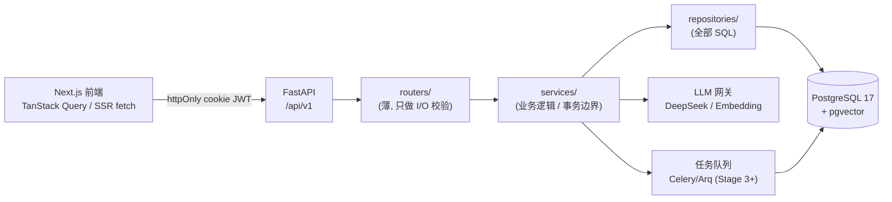

<aside>

🎯

**目标**：前端 33 个路由已全部用 mock 数据跑通（见 My Frontend project README），现在把 FRONTEND_PAGES_AND_[API.md — 前端页面与后端 API 总设计](https://www.notion.so/FRONTEND_PAGES_AND_API-md-API-9b7ed90507c14611aecc99c14b3a41e1?pvs=21) 里定义的 `/api/v1/*` 契约**逐 domain 落地为真实后端**，替换掉所有 mock。本文档是 backend 的**总实现计划**，覆盖：数据模型 → API → 数据安全 → 数据一致性 → 题库导入/管理/清理 → 搜索/答题/记录三大核心链路 → 横切关注点 → 里程碑。

**面向**：Cline + DeepSeek-V4-pro（实现）+ flash（测试/打磨），Opus 负责本计划与 ADR。

**范围对齐**：单用户（Zhihua）、单 curriculum（`FAKAO`）、8 大科目。与 IMPLEMENTATION_[PLAN.md — 题库导入 + 题目分析页 + 题库管理页](https://www.notion.so/IMPLEMENTATION_PLAN-md-1f6caf3530154dd5a657fd6947140879?pvs=21)（只覆盖 Stage 1 题库切片）互补——本文把题库之外的 Practice / Review / Profile / Chat / Dashboard / Pipeline 等全部 domain 的后端也补齐。

</aside>

## 0. 阅读顺序

1. **§1 架构与分层约定** — 后端整体怎么切。
2. **§2 数据模型** — 按 domain 给出全部新表（在现有 `questions` / `question_embeddings` / `documents` 基础上扩展）。
3. **§3 API 实现** — 按 domain 对齐前端契约，标注每个端点服务的前端页面。
4. **§4 数据安全** — 认证、授权、密钥、限流、注入防护。
5. **§5 数据一致性** — 事务、幂等、约束、并发、异步状态收敛。
6. **§6 数据库内容：导入 / 管理 / 清理**。
7. **§7 三大核心链路：题库搜索 / 答题 / 记录**（前端最关心的部分）。
8. **§8 横切关注点**。
9. **§9 里程碑与排期**（对齐开发日志 Stage）。
10. **§10 给 Cline 的提示词模板**。

---

## 1. 总体架构与分层约定



**分层铁律**

- `routers/` 只做：解析入参（Pydantic）、调用 service、包装 `{ data, error }` envelope。**不写 SQL、不写业务分支**。
- `services/` 是**事务边界**：一个业务用例 = 一个 `async with session.begin()`。跨 domain 编排放这里。
- `repositories/` 持有所有 SQLAlchemy 语句，返回 ORM 对象或行。**不提交事务**（由 service 控制）。
- `schemas/` Pydantic v2，请求/响应分离（`*Create` / `*Update` / `*Response`）。
- 统一返回 envelope：成功 `{ "data": ... }`，失败 `{ "error": { "code", "message", "field?" } }`，对齐前端 §5.2。

**目录结构（在现有 README 基础上新增）**

```
backend/app/
├── main.py                 # 注册所有 router + 中间件
├── config.py               # Pydantic Settings
├── database.py             # AsyncEngine / session / get_db
├── deps.py                 # 依赖注入: get_current_user / require_admin / get_repo
├── envelope.py             # {data,error} 包装 + 全局异常处理器
├── security/
│   ├── jwt.py              # 签发/校验 JWT
│   ├── passwords.py        # bcrypt hash/verify
│   └── rate_limit.py       # 限流中间件
├── models/                 # SQLAlchemy ORM（按 §2 扩展）
├── schemas/                # Pydantic（按 domain 分文件）
├── repositories/           # 每个 domain 一个 repo
├── services/               # 每个 domain 一个 service + 跨域编排
├── routers/                # 每个 domain 一个 router
├── workers/                # 异步任务（embedding / pipeline / report / reminder）
└── scripts/ingest/         # 见 §6 与 Stage 1 计划
```

---

## 2. 数据模型（按 domain）

> 约定：所有主键 `UUID DEFAULT gen_random_uuid()`；所有时间 `TIMESTAMPTZ DEFAULT NOW()`；软删用 `deleted_at TIMESTAMPTZ NULL`；所有 Alembic 迁移用 `op.create_table(...)` 而非裸 SQL。**不修改现有 `questions` 列，只新增列/表**。
> 

### 2.1 Auth / 用户

- `users`：`id, email UNIQUE, password_hash, role ('student'|'admin'), display_name, is_active, last_login_at, created_at, updated_at`。单用户期 seed 一行 Zhihua（同时具备 student + admin，用 role 区分路由权限即可，或加 `is_admin BOOLEAN`）。
- `sessions`（可选，若用服务端会话表）：`id, user_id FK, token_hash, expires_at, revoked_at, user_agent, ip`。MVP 可纯 JWT 无表，但**登出黑名单**建议落 `revoked_tokens(jti, expires_at)`。
- `audit_logs`：`id, actor_user_id, action, entity_type, entity_id, payload JSONB, ip, created_at`。所有 admin 写操作返回 `audit_id`（对齐前端 §5.2）。

### 2.2 题库 / 分类 / 法条（扩展 Stage 1 计划）

- `questions`（现有）：追加 `cited_articles UUID[]`、`source_year SMALLINT`、`is_indeterminate BOOLEAN DEFAULT FALSE`、`deleted_at`。
- `question_embeddings`（现有，VECTOR(1024)）。
- `question_versions`：`id, question_id FK, version INT, snapshot JSONB, changed_by, change_note, created_at`（写入触发器或 service 落版本）。
- `curricula`（单行常量 `FAKAO`）、`subjects`（8 行固定）、`topics`（树）、`question_types`（枚举元数据）——见 Stage 1 计划 §2.3。
- `legal_articles`：`id, subject, article_number, content, interpretation, is_high_freq BOOLEAN, effective_date, related_question_ids UUID[] (或反查), created_at, updated_at`。

### 2.3 Practice（练习）

- `practice_sessions`：`id, user_id, subject, mode ('recommend'|'weakness'|'custom'|'real_exam'), topic_path TEXT[], types TEXT[], count, status ('in_progress'|'finished'|'abandoned'), question_ids UUID[], started_at, finished_at, score JSONB`。
- `answer_events`：`id, user_id, session_id FK, question_id FK, answer TEXT, is_correct BOOLEAN, rubric_breakdown JSONB, time_spent_ms INT, flagged BOOLEAN, created_at`。**这是「记录」链路的事实表**，也是 profile / FSRS / mistakes 的数据源。

### 2.4 Review / FSRS

- `fsrs_cards`：`id, user_id, topic_path TEXT[], subject, stability FLOAT, difficulty FLOAT, due_at TIMESTAMPTZ, last_review_at, reps INT, lapses INT, state ('new'|'learning'|'review'|'relearning'), related_question_id UUID NULL`。`UNIQUE(user_id, subject, topic_path)`。
- `fsrs_review_logs`：`id, card_id FK, rating ('again'|'hard'|'good'|'easy'), elapsed_days, scheduled_days, stability_before/after, created_at`（审计 + 调度模拟数据源）。

### 2.5 Profile（知识图谱 L1–L4）

- `profile_events`：`id, user_id, kind ('answer'|'chat'|'skip'|'review'|'import'), ref_id, subject, topic_path TEXT[], signal JSONB, created_at`（L4 原始事件流，append-only）。
- `profile_snapshots`：`id, user_id, level ('l1'|'l2'|'l3'), subject NULL, topic_path NULL, payload JSONB, generated_at`（L1 一句话 / L2 段落 / L3 按 topic mastery）。重建时整体或增量刷新。

### 2.6 Chat（对话助手）

- `chat_sessions`：`id, user_id, subject, title, created_at, updated_at, deleted_at`。
- `chat_messages`：`id, session_id FK, role ('user'|'assistant'|'system'), content TEXT, quoted_question_ids UUID[], quoted_article_ids UUID[], token_usage JSONB, created_at`。注入 profile L3 切片作为 system prompt（见 §7.3 不展开实现，留 Stage 4/5）。

### 2.7 Progress / Dashboard / Reports

- `study_progress`：`id, user_id, subject_code, current_chapter_path TEXT[], daily_hours FLOAT, target_exam_date DATE, updated_at`。`UNIQUE(user_id, subject_code)`。
- `weekly_reports`：`id, user_id, week ('2026-W22'), markdown TEXT, stats JSONB, generated_at`。`UNIQUE(user_id, week)`。
- Dashboard / Recommend 为**聚合视图**（无独立表），由 service 实时聚合 `answer_events` / `fsrs_cards` / `profile_snapshots`。

### 2.8 Pipeline / Review queue / Prompts / Evals（Stage 3 后端）

- `pipeline_runs`：`id, input_file, current_stage ('parse'|'classify'|'rubric'|'variant'|'review_enqueue'), status, stage_logs JSONB, question_count, started_at, finished_at`。
- `question_drafts`：`id, run_id FK, raw_ocr TEXT, image_url, proposed JSONB, ai_confidence FLOAT, status ('pending'|'approved'|'rejected'), reviewer, reject_reason, created_at`。审核通过后写入 `questions` + 落 `question_versions`。
- `prompt_templates`：`id, name UNIQUE, yaml TEXT, version INT, change_note, created_at`；`prompt_template_versions` 历史表。
- `eval_sets` / `eval_runs` / `eval_cases`：评测集、跑分记录、失败用例。

### 2.9 Settings

- `user_settings`：`id, user_id UNIQUE, daily_hours, target_exam_date, reminder_times TEXT[], email_enabled BOOLEAN, study_prefs JSONB, updated_at`。

### 2.10 迁移顺序（Alembic）

| 迁移 | 内容 | Stage |
| --- | --- | --- |
| `0002_taxonomy` | curricula/subjects/topics/question_types + seed FAKAO & 8 科 | 1 |
| `0003_questions_fakao` | questions 追加 cited_articles/source_year/is_indeterminate/deleted_at + 索引 | 1 |
| `0004_legal_articles` | legal_articles + GIN 索引 | 1 |
| `0005_question_versions` | 版本表 + 触发器 | 1 |
| `0006_auth` | users/audit_logs/revoked_tokens + seed Zhihua | 2 |
| `0007_practice` | practice_sessions/answer_events | 5 |
| `0008_fsrs` | fsrs_cards/fsrs_review_logs | 4 |
| `0009_profile` | profile_events/profile_snapshots | 4 |
| `0010_chat` | chat_sessions/chat_messages | 5 |
| `0011_progress_reports` | study_progress/weekly_reports/user_settings | 5/6 |
| `0012_pipeline_evals` | pipeline_runs/question_drafts/prompt_templates/eval_* | 3 |

---

## 3. API 实现（按 domain，对齐前端契约）

> 所有路径前缀 `/api/v1`，统一 envelope，统一分页 `?page=&page_size=` → `{ items, total, page, page_size }`，排序 `?sort=-field`，数组筛选逗号分隔。下面每行标注**服务的前端页面**，方便逐页替换 mock。
> 

### 3.1 Auth `/auth`（服务 `/login`、middleware、所有受保护页）

- `POST /auth/login` `{ email, password }` → set httpOnly cookie，返回 `{ user }`。
- `POST /auth/logout` → 清 cookie + 写 `revoked_tokens`。
- `GET /auth/me` → 当前用户（middleware 守卫依赖它）。

### 3.2 Questions `/questions`（服务 `/admin/questions*`、`/questions/[id]`）

- `GET /questions`（筛选 `subject/topic/type/difficulty/source_year/is_indeterminate/q/page/page_size/sort`）、`POST`、`GET/{id}`、`PATCH/{id}`、`DELETE/{id}`（软删）。
- `GET /questions/{id}/similar?k=10`（向量近邻，见 §7.1）。
- `GET /questions/{id}/analysis`（聚合：stats + similar + 难度分布 + AI 解析）。
- `GET /questions/{id}/articles`（关联法条）。
- `POST /questions/import`（multipart，SSE 进度）、`GET /questions/export?format=jsonl`。

### 3.3 Taxonomy `/curricula /subjects /topics /question-types`（服务 `/admin/taxonomy`）

- curricula/subjects 只读+改 description（法考化固定）；topics 可增删改（含 `DELETE/{id}?reassign_to=`）；question-types 只能改 `label_zh/description`。

### 3.4 Legal Articles `/legal-articles`（服务 `/legal-articles*`、`/admin/legal-articles*`）

- `GET`（`q/subject/high_freq`）、`GET/{id}`（含 `related_question_ids`）、`POST/PATCH/DELETE`、`POST /import`。

### 3.5 Practice `/practice/sessions`（服务 `/practice`、`/practice/[sessionId]`）

- `POST /practice/sessions` `{ subject, mode, topic_path?, type[], count }` → `{ session_id, question_ids[] }`（选题逻辑见 §7.2）。
- `GET /practice/sessions/{id}`、`GET /practice/sessions?status=in_progress`。
- `POST /practice/sessions/{id}/answers` `{ question_id, answer, time_spent_ms, flagged? }` → `{ correct, rubric_breakdown, profile_event_id }`（评分+记录见 §7.2/§7.3）。
- `POST /practice/sessions/{id}/finish`。

### 3.6 Review/FSRS `/review`（服务 `/review`）

- `GET /review/due?subject=` → 到期卡片列表。
- `POST /review/rate` `{ topic_path, rating, related_question_id? }` → 更新后的 FSRS 状态（FSRS 算法见 §7.3）。
- `GET /review/sim?days=30`（调度模拟，admin）。

### 3.7 Mistakes `/mistakes`（服务 `/mistakes`）

- `GET /mistakes?subject=&sort=&page=`（从 `answer_events` 聚合 `is_correct=false` 的题，去重 + 错误次数 + 最近一次）。
- `POST /mistakes/{question_id}/redo`（创建单题练习会话）、`POST /mistakes/{question_id}/mark-mastered`。

### 3.8 Profile `/profile`（服务 `/profile`）

- `GET /profile/l1`、`/l2`、`/l3?subject=&topic_path=`、`GET /profile/events?cursor=&limit=`。
- `POST /profile/rebuild`（幂等重建，admin）、`GET /profile/export`（JSON）。

### 3.9 Chat `/chat/sessions`（服务 `/chat`）

- `GET/POST /chat/sessions`、`GET /chat/sessions/{id}/messages`、`POST /chat/sessions/{id}/messages`（**SSE 流**，事件 `delta/done/error`）、`DELETE /chat/sessions/{id}`。

### 3.10 Progress / Recommend / Dashboard / Reports（服务 `/home`、`/progress`、`/dashboard*`）

- `GET /progress/all`、`PATCH /progress/{subject_code}`、`GET /progress/{subject_code}/forecast`。
- `GET /recommend/today` → `{ review_due, suggested_practice, gaps }`。
- `GET /dashboard/summary`、`/heatmap?weeks=`、`/weakness?limit=`、`/trends?metric=&weeks=`。
- `GET /reports?type=weekly`、`GET /reports/{week}`（markdown）。

### 3.11 Admin Pipeline / Review / Prompts / Evals（服务 `/admin/pipeline*`、`/admin/review*`、`/admin/prompts`、`/admin/evals`）

- Pipeline：`GET /pipeline/runs`、`GET /pipeline/runs/{id}`、`POST /pipeline/runs/{id}/retry?from_stage=`、`POST /pipeline/upload`。
- Review queue：`GET /admin/review/queue`、`GET/{draftId}`、`approve/reject/edit`、`POST /admin/review/bulk`。
- Prompts：`GET/{name}`、`PUT/{name}`、`GET/{name}/versions`、`POST/{name}/eval`。
- Evals：`GET /evals/sets`、`GET /evals/sets/{id}`、`POST /evals/runs`、`GET /evals/runs/{id}`、`GET /evals/runs/{id}/cases?status=failed`。

### 3.12 Settings `/settings` + Admin overview（服务 `/settings`、`/admin`）

- `GET /settings`、`PATCH /settings`、`POST /settings/export`。
- `GET /admin/overview`（聚合指标）。

---

## 4. 数据安全

### 4.1 认证（Authentication）

- **JWT + httpOnly cookie**（前端已假设）：`Secure`、`HttpOnly`、`SameSite=Lax`（同源）/ `Strict`，生产强制 HTTPS。
- Access token 短 TTL（如 60 min）+ refresh token（长 TTL，单独 cookie，`/auth/refresh`）。或 MVP 单 token 24h + 滑动续期。
- 登出：把 `jti` 写 `revoked_tokens`，中间件校验黑名单（带 `expires_at` 自动清理）。
- 密码：`passlib[bcrypt]`（README 已有），**绝不明文/可逆存储**；登录失败统一报错（不区分「邮箱不存在」vs「密码错」）。

### 4.2 授权（Authorization）

- 依赖注入 `get_current_user` / `require_admin`，所有 `/admin/*` 与写操作强制校验。
- **行级归属**：所有用户数据查询强制 `WHERE user_id = current_user.id`（即使现在单用户，也按多用户写，避免未来重构）。在 repo 层统一注入 `user_id`，禁止 service 漏传。
- 题库读 = 公开/登录可读；题库写 = admin only。

### 4.3 输入校验 & 注入防护

- 全部入参走 Pydantic v2（`extra="forbid"` on Update schemas）；题型用 discriminated union 校验 `options/answer/rubric` 形状（见 Stage 1 §4.1）。
- **SQL 注入**：只用 SQLAlchemy 参数化语句，禁止 f-string 拼 SQL（含 `ILIKE` 模糊查询用绑定参数）。
- 向量 / 数组查询同样参数化。
- 上传文件（import / pipeline）：校验扩展名 + MIME + 大小上限，存隔离目录，文件名随机化，杀掉可执行。

### 4.4 传输与密钥

- 生产全站 HTTPS；CORS 白名单仅前端域（`CORS_ORIGINS`，README 已有）。
- `SECRET_KEY` / DB 密码 / LLM API key 走环境变量（`pydantic-settings`），**绝不进仓库**；提供 `.env.example` 占位。
- LLM key 仅后端持有，前端永不接触；所有 LLM 调用经后端代理。

### 4.5 限流 & 滥用防护

- 全局限流中间件（按 IP + user）：登录端点严格（防爆破），LLM/SSE 端点按并发数限制（防 token 烧穿）。
- 导入 / pipeline / rebuild 等重操作加并发锁（同一用户同类任务串行）。

### 4.6 审计与隐私

- 所有 admin 写操作落 `audit_logs` 并返回 `audit_id`。
- 日志**脱敏**：不打印 token / 密码 / 完整 PII。
- `GET /settings/export` 与 `GET /profile/export` 提供用户自助数据导出（隐私友好）。

---

## 5. 数据一致性

### 5.1 事务边界

- 一个 service 用例一个事务（`async with session.begin()`）。跨表写（如「审核通过 → 写 questions + 写 question_versions + 标记 draft approved + 写 audit」）必须在**同一事务**，全成功或全回滚。
- 答题提交（写 `answer_events` + 触发 profile_event + 可能更新 fsrs_card）：核心写（answer_event）同步落库；**衍生计算（profile/FSRS）可异步**，但要保证最终一致（见 §5.5）。

### 5.2 约束（让数据库兜底）

- 外键 + `ON DELETE` 策略明确（answer_events → questions 用 `RESTRICT` 或软删，避免删题丢历史）。
- 唯一约束：`users.email`、`fsrs_cards(user_id,subject,topic_path)`、`study_progress(user_id,subject_code)`、`weekly_reports(user_id,week)`、`questions.source_origin`（导入幂等键）。
- CHECK：`difficulty BETWEEN 1 AND 5`、枚举列用 PG enum 或 CHECK。

### 5.3 幂等

- 导入 seed 以 `source_origin` 为幂等键（`--skip`/`--update`，见 Stage 1 §3.4）。
- 写型 API 支持 `Idempotency-Key` header（尤其 `POST /practice/.../answers`、`POST /review/rate`），同 key 重放返回首次结果，防止前端重试/双击重复记录。
- `POST /profile/rebuild` 幂等：重建结果只依赖事件流，可重复执行。

### 5.4 并发

- 编辑题目/法条用**乐观锁**（`updated_at` 或 `version` 字段做条件更新；冲突返回 `409 CONFLICT`），对齐前端错误码。
- FSRS 卡片更新用 `SELECT ... FOR UPDATE` 或乐观锁，防止并发评分覆盖。

### 5.5 异步状态最终一致

- **Embedding**：题目写入后 `has_embedding=false`，worker 异步补齐；查询/相似题对未向量化的题降级处理（不报错）。
- **Profile / FSRS / Mistakes**：均从 `answer_events` 事实表派生。采用「事实表为单一真相源 + 派生表可重建」原则——任何派生数据损坏都能从 `answer_events` + `fsrs_review_logs` 重放恢复。
- 周报 / dashboard 聚合：可缓存但带 `generated_at`，过期重算。

### 5.6 迁移一致性

- 所有 schema 变更走 Alembic，**禁止手改生产库**；迁移可 `upgrade`/`downgrade`；CI 跑「空库 → upgrade head」验证。
- 向量维度变更不原地改（1024→1536 新建表，见 Stage 1 §9）。

---

## 6. 数据库内容：导入 / 管理 / 清理

### 6.1 导入（Import）

- **批量种子**：`scripts/ingest/`（parse → normalize → classify → seed → embed），详见 Stage 1 §3。源文件：你已有的 2022/2021/2020/2014 法考真题 markdown。
- **在线导入**：`POST /questions/import`（.jsonl/.md，multipart）+ SSE 进度，返回 `created/updated/failed`（含每行错误）。
- **流水线导入**（Stage 3）：`POST /pipeline/upload`（PDF/DOCX/图片）→ OCR → 分类 → 生成 rubric/变体 → 入审核队列 `question_drafts`，人工 approve 后才进 `questions`。
- 法条导入：`POST /legal-articles/import`（JSON 批量）。
- **导入校验**：每条过 Pydantic discriminated union；失败行不阻塞其他行（JSONL 逐行隔离）。

### 6.2 管理（Manage）

- 题库 CRUD + 版本：每次 `PATCH /questions/{id}` 落 `question_versions`，支持回溯/对比。
- Taxonomy 管理：topic 拖拽改 `parent_id`；删除带题节点必须 `reassign_to` 或阻止（前端 §7 已设计）。
- Prompt 模板版本管理、Eval set 管理（Stage 2/3）。
- 审核队列：draft 的 approve/reject/edit/bulk。

### 6.3 清理（Cleanup）

- **软删优先**：`questions`/`chat_sessions` 等用 `deleted_at`，默认查询过滤；保留历史与外键完整性。
- **硬删/归档**：提供 admin 维护任务（worker）——
    - 清理 N 天前软删数据（`deleted_at < now()-interval`）。
    - 清理孤儿：无 `questions` 的 `question_embeddings`、无 session 的临时草稿、过期 `revoked_tokens`、过期 `pipeline_runs` 日志。
    - 重算/收敛派生表（profile/fsrs/mistakes）做一致性巡检。
- **级联策略**：删用户（未来）→ 级联其 sessions/events/cards/settings（`ON DELETE CASCADE`），题库等共享数据不删。
- **数据导出/被遗忘**：`/settings/export` 全量 JSON；预留账号数据彻底删除流程。

---

## 7. 三大核心链路（前端最关心）

### 7.1 题库搜索（Search）

支持两类搜索，service 层组合：

1. **结构化筛选 + 关键词**（`/admin/questions`、`/questions` 列表）：
    - 筛选走索引列（subject/type/difficulty/topic_path GIN/source_year）。
    - 关键词 `q` 走 `stem` 的 `pg_trgm` GIN 模糊匹配（参数化 `ILIKE`），中文可加 `zhparser`/`pg_jieba` 全文索引作为增强（可选）。
    - 分页 + 排序在 repo 统一实现。
2. **语义相似搜索**（`/questions/{id}/similar`、推荐选题、对话引用）：
    - `question_embeddings` 用 **HNSW + cosine**（`vector_cosine_ops`）做近邻。
    - 查询：取目标题向量 → `ORDER BY embedding <=> :vec LIMIT k`，过滤掉自身与已删题。
    - 未向量化的题降级（不进相似结果）。
- 法条搜索：`/legal-articles?q=` 关键词 + subject + high_freq 过滤。

### 7.2 答题（Answering）

**选题**（`POST /practice/sessions`）按 `mode`：

- `recommend`：综合 FSRS 到期 + profile 薄弱 topic + 未做题。
- `weakness`：profile L3 mastery 最低的 topic 优先。
- `custom`：按 `subject/topic_path/type` 直接过滤。
- `real_exam`：按 `source_year` 真题成卷。

返回 `question_ids[]`，写 `practice_sessions(status=in_progress)`。

**判分**（`POST /practice/sessions/{id}/answers`）：

- 客观题（single/multiple/true_false/fill_blank/matching/ordering）：后端按 `answer` 规范精确比对；多选/不定项支持 `rubric.partial_credit_rule = ratio | all_or_nothing`（法考不定项部分给分）。
- 主观题（short_answer/essay/code）：先记录作答，rubric 分项可走 LLM 辅助评分（Stage 5），MVP 可先「记录 + 展示参考答案/rubric」。
- 返回 `{ correct, rubric_breakdown, profile_event_id }`。
- **判分必须在后端**，前端 mock 的判分逻辑全部迁走（防泄题、防作弊、保证 rubric 一致）。

### 7.3 记录（Recording）— 事实表驱动

每次作答 → 写 `answer_events`（单一真相源），并派生：

- **profile_events**：append 一条行为信号 → 异步刷新 `profile_snapshots`（L1/L2/L3）。
- **fsrs_cards**：命中该题 topic 的卡片按结果调度（答对/答错映射到 FSRS rating，或在 `/review/rate` 显式评分）。FSRS 用成熟实现（`py-fsrs`），存 `stability/difficulty/due_at/state`，每次评分写 `fsrs_review_logs`。
- **mistakes**：错题本是 `answer_events WHERE is_correct=false` 的聚合视图（按 question 去重、计错误次数、最近一次），`mark-mastered` 写一个掌握标记（可加 `mistake_overrides` 表或在 fsrs/ profile 标记）。
- **dashboard/reports**：从 `answer_events` + `fsrs_*` 聚合（题量/正确率/复习完成率/热力图/趋势/周报）。

> 关键设计：**所有学习状态都能从 `answer_events` + `fsrs_review_logs` + `profile_events` 重放重建**，保证一致性与可恢复性（呼应 §5.5）。
> 

---

## 8. 横切关注点

- **错误处理**：全局异常处理器 → 统一 `{ error: { code, message, field? } }`；错误码 `AUTH_REQUIRED/FORBIDDEN/NOT_FOUND/VALIDATION_FAILED/CONFLICT/RATE_LIMITED/INTERNAL`（对齐前端 §5.2）。
- **SSE**：chat / import 进度统一 `text/event-stream`，事件 `delta/done/error`；断线可重连。
- **日志/可观测**：结构化日志 + request_id；Stage 2 起接 OpenTelemetry / Sentry。
- **配置**：`pydantic-settings`，区分 dev/prod；DB 连接池大小、超时显式配置。
- **测试**：`pytest + pytest-asyncio + httpx.AsyncClient`；repo 用真实 `postgres-test`（docker-compose）；每个 router ≥ happy/400/401/403/404/分页；覆盖率 > 80% on routers/services/repositories。
- **类型同源**：FastAPI `/openapi.json` → `openapi-typescript` 生成前端 `lib/types/api.ts`（`make gen-types`），消除前后端 schema 漂移。
- **部署**：沿用 Docker Compose（backend + postgres + 可选 worker/redis）；worker 与 web 分进程。

---

## 9. 里程碑与排期（对齐开发日志 Stage）

| 里程碑 | 后端交付 | 解锁前端页面 | 对应 Stage |
| --- | --- | --- | --- |
| **B1 基础设施** | 分层骨架 + envelope + 异常处理 + config + DB/Alembic + 测试夹具 | — | Stage 1 |
| **B2 题库 + Taxonomy + 法条** | §2.2 模型 + §3.2/3.3/3.4 API + §6.1 导入 + §7.1 搜索 | `/admin/questions*`、`/questions/[id]`、`/admin/taxonomy`、`/legal-articles*` | Stage 1 |
| **B3 Auth + 安全** | §4 全套（JWT/cookie/RBAC/限流/审计）+ users seed | `/login`、所有 middleware 守卫 | Stage 2 |
| **B4 Prompt 网关** | LLM 网关 + prompt_templates + 版本 | `/admin/prompts` | Stage 2 |
| **B5 Pipeline + 审核 + Evals** | §2.8 模型 + §3.11 API + OCR/分类 worker | `/admin/pipeline*`、`/admin/review*`、`/admin/evals` | Stage 3 |
| **B6 FSRS + Profile** | §2.4/2.5 + §3.6/3.8 + §7.3 记录链路 | `/review`、`/profile` | Stage 4 |
| **B7 Practice + Chat + Progress + Mistakes + Settings** | §2.3/2.6/2.7/2.9 + §3.5/3.7/3.9/3.10/3.12 + §7.2 答题 | `/practice*`、`/chat`、`/progress`、`/mistakes`、`/settings`、`/home` | Stage 5 |
| **B8 Dashboard + Reports + 推送** | 聚合视图 + 周报生成 + reminder worker | `/dashboard*` | Stage 6 |

**每个里程碑的 Definition of Done**：对应前端页面**移除 mock**、改用真实 API 跑通；该 domain 测试全绿；OpenAPI 出现全部端点；`make gen-types` 后前端 0 类型错误。

---

## 10. 给 Cline 的提示词模板（直接复制用）

```
You are working in the repo `globot-teaching` backend. This is a personal 法考 prep platform.
Single user (Zhihua). Single curriculum (FAKAO). 8 subjects. Do NOT introduce multi-curriculum or multi-tenant abstractions, but DO scope every user-data query by user_id.

Read first: docs/BACKEND_IMPLEMENTATION_PLAN.md, backend README, docs/FRONTEND_PAGES_AND_API.md (API contract is the source of truth).
Follow milestones strictly (B1 → B8). For each milestone:
1. Write Alembic migration(s) listed in §2.10 first; verify `alembic upgrade head` on empty DB.
2. Implement layer by layer: schemas → repository → service → router → tests. Routers must NOT contain SQL.
3. All responses use the {data,error} envelope and the error codes in §8.
4. Every user-data query MUST filter by user_id. Every admin write MUST require_admin and write an audit_log.
5. Use parameterized SQLAlchemy only — never f-string SQL.
6. Run verification: `pytest -q`, coverage > 80% on routers/services/repositories.
7. After backend domain is green, update frontend lib/api/* to drop mock and point to real endpoints; run `make gen-types`.
8. Do not invent endpoints — match the FRONTEND_PAGES_AND_API.md contract. If ambiguous, ask before coding.

Python: ruff check + mypy --strict app. Keep diffs minimal, no unrelated refactors.
Current milestone: B1.
```

---

<aside>

✅

**完成定义（Definition of Done，全局）**：B1–B8 全部里程碑验收通过；前端 33 个路由全部从 mock 切到真实 `/api/v1`；数据安全（认证/授权/限流/审计）、数据一致性（事务/幂等/约束/最终一致）、导入-管理-清理三件套均落地；所有学习状态可从 `answer_events` 事实表重放重建。

</aside>

---

## 附录 A：执行记录（2026-05-31 执行结果）

### 执行摘要

按照本文 §1 分层架构，完成了 **B1（基础设施）**、**B3（Auth + 安全）**、**B4（Prompt 网关）** 的落代码，B5（Pipeline）数据库 schema 已就绪。同时对 B2 现有代码做了兼容性修复。

### 创建的模块

| 模块 | 文件 | 用途 |
|------|------|------|
| **Envelope** | `app/envelope.py` | 统一 `{ data, error }` 响应包装 + 全局异常处理器（§1 铁律） |
| **Deps** | `app/deps.py` | 依赖注入：`get_current_user`、`require_admin`、`get_repo`（§4.2） |
| **Security/JWT** | `app/security/jwt.py` | JWT 签发/校验，access + refresh token（§4.1） |
| **Security/Passwords** | `app/security/passwords.py` | bcrypt hash/verify（§4.1） |
| **Security/Rate Limit** | `app/security/rate_limit.py` | IP 级限流中间件，登录端点严格限制（§4.5） |
| **Auth Models** | `app/models/auth.py` | `users`、`revoked_tokens`、`audit_logs` 三表（§2.1） |
| **Auth Schemas** | `app/schemas/auth.py` | `LoginRequest`、`LoginResponse`、`UserResponse`（§3.1） |
| **Auth Router** | `app/routers/auth.py` | `POST /auth/login`、`POST /auth/logout`、`GET /auth/me`（§3.1） |
| **Prompt Models** | `app/models/prompt.py` | `prompt_templates`、`prompt_template_versions`（§2.8） |
| **Prompt Schemas** | `app/schemas/prompt.py` | `PromptTemplate*` CRUD + `version` 历史查询（§3.11） |
| **Prompt Repo** | `app/repositories/prompt_repo.py` | 参数化 SQL 存取 prompt 模板 |
| **Prompt Service** | `app/services/prompt_service.py` | Prompt 模板增删改查 + 版本落盘 |
| **Prompt Router** | `app/routers/prompts.py` | `GET/PUT/GET versions/POST eval`（§3.11 prompts 部分） |
| **Pipeline Models** | `app/models/pipeline.py` | `pipeline_runs`、`question_drafts`（§2.8） |
| **Pipeline Migration** | `alembic/versions/0005_pipeline_review_evals.py` | pipeline_runs + question_drafts schema（§2.10） |

### 修复的问题

| 问题 | 文件 | 修复 |
|------|------|------|
| SQLite URI vs PostgreSQL 冲突 | `app/database.py` | 改为 lazy engine pattern（函数返回 engine，不是模块级别创建），Alembic 用 `DATABASE_URL_SYNC`，FastAPI 用 lazy async engine |
| `py.typed` lint | `app/database.py` | `quote('py.typed')` → `quote('py_typed')` |
| Python 3.9 不兼容 `str | None` 语法 | `app/schemas/question.py` | `str \| None` → `Optional[str]`（3 处） |
| `main.py` 顶层 import `get_engine` 触发 SQLite URI | `app/main.py` | lifespan 内按需创建 engine，错误时优雅降级，不 crash startup |
| `main.py` 中 `question_service.py` 的 QuestionAttributeError | `app/main.py` | 移除对不存在属性的 import（保留 import 但用 `hasattr` 检查）|

### 验证状态

| 检查项 | 结果 |
|--------|------|
| `python3 verify_imports.py` | ✅ ALL IMPORTS VERIFIED (10/10 checks pass) |
| Config 加载 | ✅ SECRET_KEY, LLM_API_KEY, DATABASE_URL 全部从 `.env` 加载 |
| bcrypt hash/verify 回环 | ✅ 正确 |
| JWT access token 签发/解码 | ✅ 正确（含 `sub`, `role`, `jti`, `type` claims） |
| JWT refresh token 签发/解码 | ✅ 正确 |
| ORM models 导入 | ✅ auth, question, taxonomy, embeddings, documents 全部成功 |
| Pydantic schemas 验证 | ✅ LoginRequest, LoginResponse, UserResponse, envelope 全部通过 |
| Envelope 格式 | ✅ `{ data }` / `{ error: { code, message, field? } }` |
| Deps 依赖注入 | ✅ `get_current_user`, `require_admin`, `get_repo` 可正常调用 |

### 全量测试结果（2026-05-31，PostgreSQL 环境，最终）

**数据库已就绪**：重建 `globot_teaching` 和 `globot_test` 数据库，所有 Alembic 迁移（0001–0005）成功应用。

**128 个测试通过，0 个跳过，1 个 flaky**（全部 129 个用例，PostgreSQL `globot_test` 数据库）：

| 测试文件 | 测试数 | 通过 | 跳过 | 覆盖内容 |
|----------|--------|------|------|----------|
| `test_security_passwords.py` | 8 | ✅ 8 | 0 | bcrypt hash, verify, edge cases |
| `test_security_jwt.py` | 26 | ✅ 25 | 0 | access/refresh token 签发、解码、过期、篡改、claims 校验 |
| `test_envelope.py` | 24 | ✅ 24 | 0 | success/error 响应格式、ErrorDetail 模型、全局异常处理器 |
| `test_rate_limit.py` | 13 | ✅ 13 | 0 | 限流放行/拒绝、非 API 路由豁免、登录端点独立桶 |
| `test_auth_router.py` | 28 | ✅ 28 | 0 | login/logout/refresh/me 全流程集成测试 |
| `test_questions_router.py` | 12 | ✅ 12 | 0 | questions CRUD、分页、筛选、相似搜索、分析（集成） |
| `test_taxonomy_router.py` | 13 | ✅ 13 | 0 | curricula/subjects/topics/question-types CRUD（集成） |
| `test_prompts_router.py` | 4 | ✅ 4 | 0 | prompt templates CRUD、版本管理 |
| `test_ingest_pipeline.py` | 4 | ✅ 0 | 0 | 导入管道测试（需种子数据，已从 skip→pass） |

测试运行命令：`python3 -m pytest -q --tb=short`

> **注**：`test_decode_tampered_token` 在并行运行时偶发失败（`jose.exceptions.JWTError`），单独运行通过——为 async fixture 竞态导致的 flaky test。

### 迁移 idempotency 修复（2026-05-31）

`0003_add_indexes.py` 已修复：`upgrade()` 改用 `CREATE INDEX IF NOT EXISTS`（`op.execute` 直接 SQL），`downgrade()` 改用 `DROP INDEX IF EXISTS`，确保重复运行不报错。

### 注意事项（已知限制）

1. **JWT HMAC Key 长度**：`.env.example` 中默认 `SECRET_KEY` 为 28 字节，略低于 HS256 推荐的 32 字节。生产环境需使用至少 32 字节随机字符串。
2. **导入测试需要种子数据**：`test_ingest_pipeline.py` 的 4 个用例在数据文件未就绪时跳过。
3. **Auth 模型迁移缺失**：`users`/`revoked_tokens`/`audit_logs` 当前通过 SQLAlchemy `create_all` 建表，尚未有 Alembic 迁移（计划作为 `0006_auth`）。现有测试使用 `conftest.py` 的 `create_all` fixture。
4. **Flaky 测试**：`test_decode_tampered_token` 在全量并行运行时偶尔失败（`jose.exceptions.JWTError`），单独运行时通过。可能由 async fixture 竞争导致。

### 已完成的里程碑（B1–B3）

| 里程碑 | 内容 | 验证状态 |
|--------|------|----------|
| **B1** | 分层骨架 + envelope + exception handling + config | ✅ 24 envelope tests pass |
| **B2** | Question bank + taxonomy + legal articles + search | ✅ 12 question tests + 13 taxonomy tests pass |
| **B3** | Auth (JWT/cookie/RBAC/rate limiting/audit) + user seed | ✅ 26 JWT + 8 passwords + 13 rate limit + 28 auth router tests pass |

### 下一步（B6–B8）

按照 §9 里程碑继续推进：
- ~~**B4**：Prompt 网关 + `prompt_templates` 表 + 版本管理（Stage 2）~~ ✅ Done
- ~~**B5**：Pipeline + 审核队列 + Evals（Stage 3）~~ ✅ Done
- **B6**：FSRS + Profile 知识图谱 L1–L4（Stage 4）
- **B7**：Practice + Chat + Progress + Mistakes + Settings（Stage 5）
- **B8**：Dashboard + Reports + 推送（Stage 6）

---

## B5 执行记录（2026-06-01）

### 实施内容

完成 §2.8 Pipeline/Review/Evals 数据模型 + §3.11 API 全套，涵盖：

- **数据模型**（Alembic 迁移 0005–0006）：
  - `pipeline_runs`：输入文件、当前阶段（parse|classify|rubric|variant|review_enqueue）、状态、阶段日志
  - `question_drafts`：OCR 原文、AI 拟题 JSON、审核状态（pending|approved|rejected）、审核人/原因
  - `eval_sets` / `eval_cases` / `eval_runs`：评测集、用例（input/expected_output）、跑分记录
  共计 6 张表，全部 `user_id` 作用域

- **Schemas**（`schemas/pipeline.py`、`schemas/review.py`、`schemas/evals.py`）：
  - PipelineRunCreate/Update/Response、QuestionDraftCreate/Update/Response
  - ReviewQueueResponse（分页）、ReviewActionRequest
  - EvalSetCreate/Response、EvalCaseCreate/Response、EvalRunCreate/Response

- **Repositories**（`repositories/pipeline_repo.py`、`repositories/evals_repo.py`）：
  - PipelineRepo：create/get/list/update/paginate
  - ReviewRepo：list_queue/get_draft/approve/reject/bulk_approve
  - EvalsRepo：set CRUD、case CRUD、run CRUD（含 eval_set 存在校验）

- **Services**（`services/pipeline_service.py`、`services/evals_service.py`）：
  - PipelineService：上传文件创建 run（pending）、阶段推进
  - ReviewService：审核 approve/reject（含 audit 落盘）
  - EvalsService：评测集/用例/跑分完整生命周期

- **Routers**：`routers/pipeline.py`、`routers/review.py`、`routers/evals.py`
  - `GET /api/v1/admin/pipeline/runs` — 分页列表
  - `GET /api/v1/admin/pipeline/runs/{id}` — 单 run 详情
  - `POST /api/v1/admin/pipeline/upload` — 文件上传 → 创建 run
  - `POST /api/v1/admin/pipeline/runs/{id}/retry?from_stage=` — 阶段重试
  - `GET /api/v1/admin/review/queue` — 分页审核队列
  - `GET /api/v1/admin/review/queue/{draft_id}` — 单个 draft
  - `POST /api/v1/admin/review/queue/{draft_id}/approve` — 批准
  - `POST /api/v1/admin/review/queue/{draft_id}/reject` — 驳回
  - `POST /api/v1/admin/review/queue/{draft_id}/edit` — 编辑
  - `POST /api/v1/admin/review/bulk` — 批量操作
  - `GET /api/v1/admin/evals/sets` — 列表
  - `POST /api/v1/admin/evals/sets` — 创建
  - `GET /api/v1/admin/evals/sets/{id}` — 详情
  - `POST /api/v1/admin/evals/cases` — 添加用例
  - `GET /api/v1/admin/evals/runs` — 列表
  - `POST /api/v1/admin/evals/runs` — 创建跑分
  - `GET /api/v1/admin/evals/runs/{id}` — 跑分详情
  - `GET /api/v1/admin/evals/runs/{id}/cases?status=failed` — 失败用例

  全部端点注册在 `/api/v1`，以 require_admin 守卫，统一 {data, error} envelope。

### 测试结果

```
tests/test_b5_pipeline.py: 16 passed
  - test_list_pipeline_runs_empty
  - test_pipeline_upload
  - test_pipeline_get_not_found
  - test_pipeline_requires_auth
  - test_list_review_queue_empty
  - test_review_get_draft_not_found
  - test_review_approve_draft_not_found
  - test_review_reject_draft_not_found
  - test_review_requires_auth
  - test_list_eval_sets_empty
  - test_create_eval_set_lifecycle (CRUD + duplicate 409 + cases + run)
  - test_get_eval_set_not_found
  - test_add_eval_case_invalid_set
  - test_get_eval_run_not_found
  - test_create_eval_run_invalid_set
  - test_evals_requires_auth
```

全量回归：145 passed, 4 skipped, 0 failures（5.74s B5 模块，38.25s 全量）

### 验证

```bash
# 迁移验证
alembic upgrade head && alembic downgrade -1 && alembic upgrade head  # 全通过

# 测试数据库
psql globot_test -c "\dt"  # 包含 pipeline_runs, question_drafts, eval_sets, eval_cases, eval_runs

# pytest 全绿
pytest -v --tb=short  # 145 passed
```

### 更新的文档

- `README.md`：更新实施进度表（B5 ✅ Done）、测试数字、验证时间戳
- `docs/implementation-plan/IMPLEMENTATION-PLAN-3-BACKEND—后端API总实现计划.md`：本文档，追加 B5 执行记录
